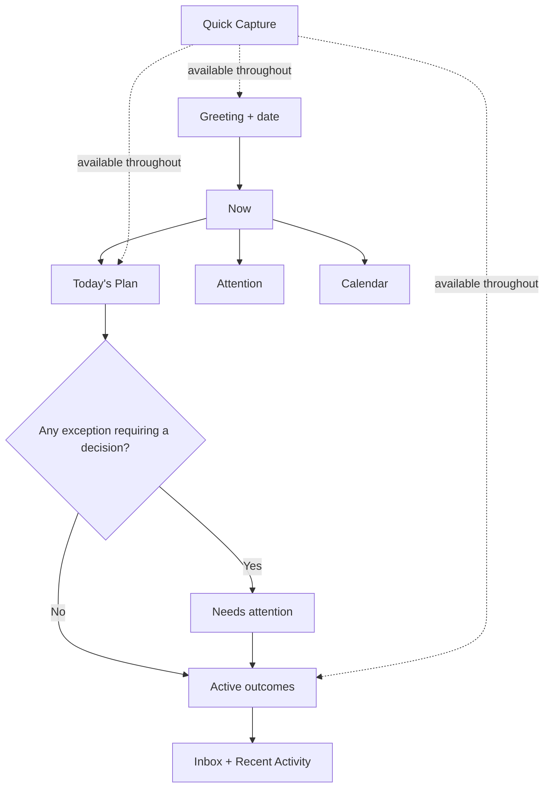
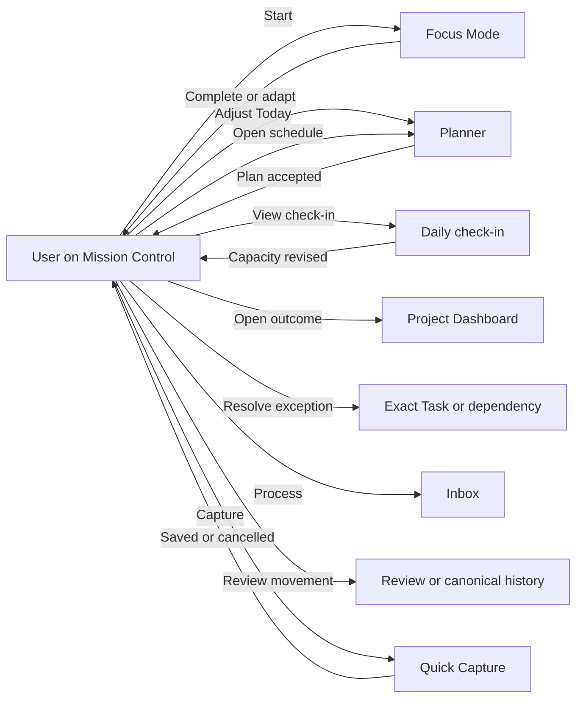
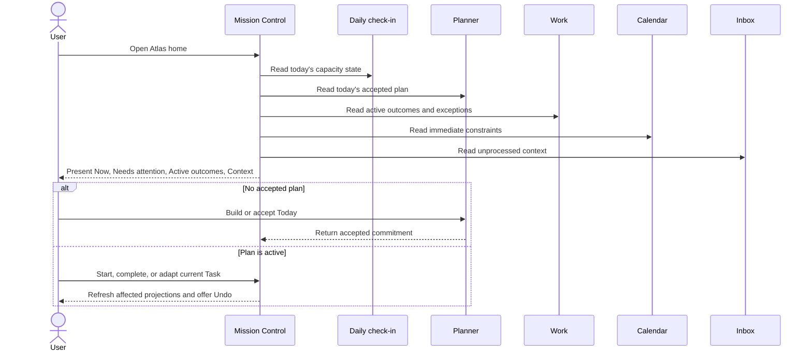
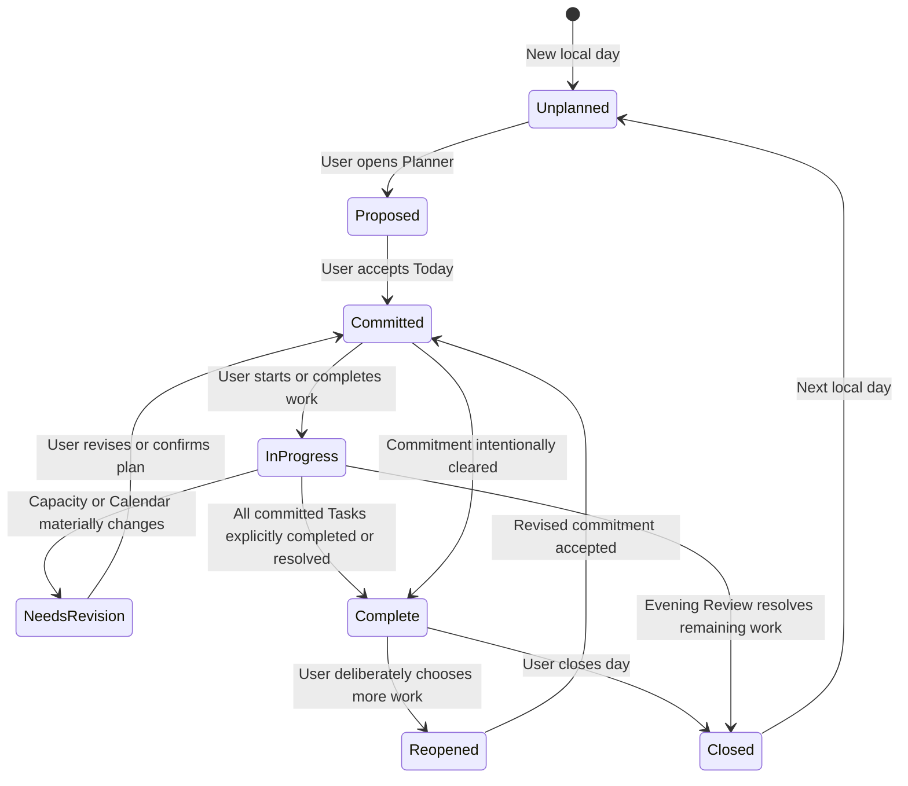
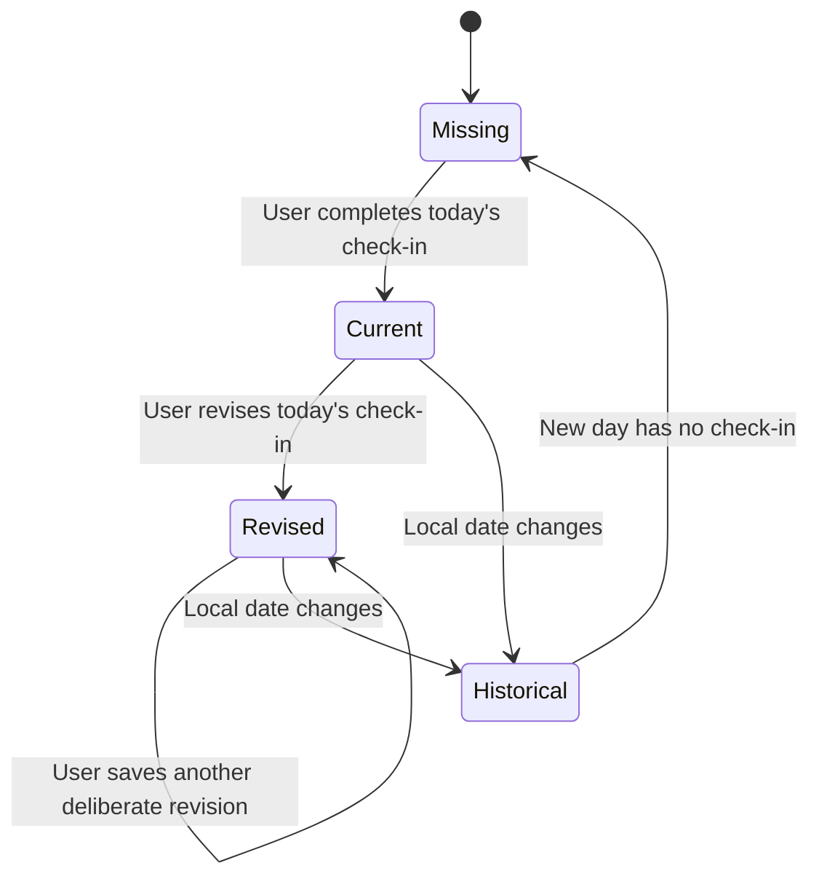
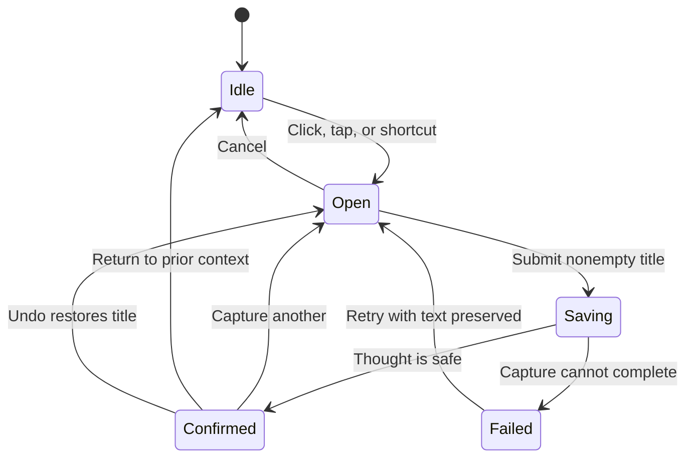

# Atlas Mission Control Specification

**Sprint:** 6.5.5
**Date:** 2026-08-24
**Status:** Product and interaction specification only. This document does not prescribe implementation.

## Purpose

Mission Control is Atlas's home and the first view of the user's day. It should answer one question:

> **What deserves my attention today?**

It must answer that question without hiding the context that makes a decision trustworthy: available attention, the accepted plan, real time constraints, blocked or waiting work, active Project outcomes, Inbox pressure, and meaningful recent movement.

Mission Control is a command centre, not an analytics dashboard. It summarizes and routes decisions while canonical editing remains in Planner, Work, Inbox, Review, and Settings.

## Design principles

1. **The accepted plan is dominant.** Greeting and capacity support the decision; they do not compete with it.
2. **Projects remain continuously visible.** Every intentionally active outcome is represented without an unexplained top-N limit.
3. **Exceptions interrupt hierarchy, not attention.** Blockers, waiting conditions, date conflicts, and missing next actions appear only when they require a decision.
4. **Context is compact, not hidden.** Project outcome, Calendar constraint, and capacity consequence appear close to the Task they affect.
5. **Suggestions are not Today.** Mission Control shows accepted commitments. Planner owns proposing and changing the plan.
6. **The page works without a check-in, Calendar, Inbox, or history.** Missing supporting context never makes the home unusable.
7. **Information density follows decision value.** The page uses generous whitespace around major horizons and tighter spacing within related rows.
8. **Capture is immediate but subordinate.** Quick Capture is always reachable and never steals focus on page load.
9. **Activity means movement.** Recent Activity excludes incidental edits and usage noise.
10. **The same hierarchy survives every viewport.** Desktop columns may improve scanning, but mobile order defines semantic order.

## Current implementation review

### Current hierarchy

The existing page is composed in this order:

```text
Greeting card                 Attention Budget card
Today's Focus
Blocked                      Inbox
Projects grouped by every configured Area
Persistent desktop / floating mobile Capture
```

This composition is clean and reusable, but each group receives similar card weight and large separation. The result is visually calm while the decision hierarchy remains weak.

| Current element | What works | Current friction |
| --- | --- | --- |
| Greeting | Warm, date-aware, and personal | Largest type and accent card occupy prime space without answering the day question |
| Attention | Capacity, energy, and stress are visible | Exact percentage and large star ratings imply precision; action still says “Complete daily review” after a result exists |
| Today's Focus | Limits focus and keeps the section prominent | It is an automatically generated focus result rather than an explicit accepted plan |
| Focus Item | Preserves Project outcome context | Outcome becomes the headline and concrete Task becomes “Supporting action,” weakening action clarity |
| Blocked | Gives constraints a dedicated place | Nested Project blockers can be omitted; blocked rows are labelled Waiting; an empty section still consumes substantial space |
| Inbox | Count and route are clear | A large card communicates only one number and offers no sense of what needs processing |
| Projects | Projects remain visible and grouped by Area | Projects come last; each Area gets a full card and description, including empty Areas; next action and health are missing |
| Capture | Title-only, keyboard-aware, and mobile reachable | Desktop field is fixed, always visible, and auto-focused, which can steal intent and compete with the page |

Calendar and Recent Activity do not currently exist on Mission Control.

### Current spacing

The current semantic tokens establish:

- page block padding of roughly 40–80px;
- top-level section gaps of roughly 56–88px;
- card gaps of roughly 20–28px;
- large-card padding of roughly 28–40px;
- a maximum content width around 1200px;
- display typography around 42–76px.

These values create a calm visual language. The problem is not whitespace itself; it is uniform application. Greeting, Today, empty Blocked, Inbox count, and every Area group all receive “major section” treatment. Repeated empty states and Area descriptions turn generous spacing into a long, slow page.

The redesign keeps generous page margins and rounded cards but introduces three spatial levels:

| Level | Purpose | Relative spacing |
| --- | --- | --- |
| Major horizon | Separate Now, Needs attention, Active outcomes, and Context | Most generous |
| Related modules | Separate cards within the same decision horizon | Moderate |
| Row detail | Separate labels, metadata, and actions within one object | Compact |

Conditional and empty modules collapse instead of preserving full section height. The greeting is no longer a padded hero card.

### Current information density

The page has **low local density but high global scan cost**:

- the greeting and attention metric use very large typography;
- Today's Focus repeats outcome and action labels for every Project Task;
- Blocked and Inbox use full sections regardless of content;
- Project groups repeat Area description, outcome labels, status, and energy;
- empty Areas remain visible;
- there is no Calendar or movement context despite the long page.

The redesign increases useful density inside Today's Plan, Calendar, Project rows, and Recent Activity while reducing repeated labels and empty cards. It does not solve density by hiding Projects or turning the page into compact tables.

### Current navigation

There is no persistent product navigation. Mission Control exposes contextual links to Review, Focus Mode, Inbox, and Projects. Other destinations depend on returning through the home. The current root shell adds Capture but no stable location indicator.

The redesign adopts the information architecture's five primary destinations:

1. Mission Control;
2. Work;
3. Planner;
4. Inbox;
5. Review.

Settings remains a utility destination. Focus Mode remains intentionally isolated.

### Current interaction model

Mission Control is mostly read-only and route-driven:

- Daily Review happens on another screen;
- Focus Mode opens only when generated focus exists;
- plan membership cannot be accepted or adjusted;
- Project cards open detail but cannot explain health or next action;
- Inbox opens processing;
- Capture updates selected views through a same-tab event;
- loading replaces the entire page with a preparation state;
- load failure replaces the page with a retry state and outdated browser-local wording.

The redesigned home keeps deep editing elsewhere but supports direct daily actions: start focus, complete or adapt a visible Task, revise the plan, inspect an exception, process Inbox, open a Project, review activity, and capture without losing context.

## Target information hierarchy

Mission Control uses three decision horizons plus supporting context:

| Order | Horizon | Question | Content |
| --- | --- | --- | --- |
| 1 | **Now** | What am I committing attention to today? | Greeting, Attention, Today's Plan, immediate Calendar constraints |
| 2 | **Needs attention** | What prevents or threatens meaningful progress? | Blocked and Waiting work, Calendar conflicts, overdue decisions, Projects missing next actions |
| 3 | **Active outcomes** | What larger outcomes must remain visible? | Complete compact Project horizon grouped by Area |
| 4 | **Context** | What should I process or remember changed? | Inbox and Recent Activity |

Quick Capture is a global action rather than another section.



## Desktop wireframe

```text
┌────────────────────────────────────────────────────────────────────────────┐
│ ATLAS   Mission Control  Work  Planner  Inbox  Review    [Capture… C] [⚙] │
├────────────────────────────────────────────────────────────────────────────┤
│ Good morning, Maike                                      Monday · 24 August│
│ What deserves your attention today?                                        │
│                                                                            │
│ ┌──────────────────────────────────────────────────┐ ┌────────────────────┐ │
│ │ TODAY'S PLAN                          [Adjust]   │ │ ATTENTION          │ │
│ │                                                  │ │ Moderate capacity  │ │
│ │ CURRENT                                          │ │ Two commitments fit│ │
│ │ Configure Railway health check                   │ │ Checked 08:12      │ │
│ │ Deploy Atlas · Atlas available on every device   │ │ [View check-in]    │ │
│ │ 30 min · Medium energy            [Start Focus]  │ ├────────────────────┤ │
│ │                                                  │ │ CALENDAR           │ │
│ │ NEXT                                             │ │ 10:00 Team sync    │ │
│ │ 2  Verify access on phone                        │ │ 13:00–15:00 open   │ │
│ │ 3  Measure laundry room worktop                  │ │ [Open Planner]     │ │
│ │                                                  │ └────────────────────┘ │
│ │ 2 of 3 remaining                                 │                        │
│ └──────────────────────────────────────────────────┘                        │
│                                                                            │
│ NEEDS ATTENTION                                                            │
│ ┌────────────────────────────────────────────────────────────────────────┐ │
│ │ Waiting · Domain verification blocks secure access · Review tomorrow  │ │
│ │ Calendar conflict · “Measure worktop” overlaps appointment            │ │
│ └────────────────────────────────────────────────────────────────────────┘ │
│                                                                            │
│ ACTIVE OUTCOMES                                          [Open Projects]   │
│ Work                                                                       │
│ ┌─────────────────────────────────┐ ┌─────────────────────────────────┐    │
│ │ Deploy Atlas · At risk          │ │ Ambiogen · Moving              │    │
│ │ Available securely everywhere  │ │ Validated workflow ready       │    │
│ │ Next: Configure health check    │ │ Next: Review flowcell data     │    │
│ └─────────────────────────────────┘ └─────────────────────────────────┘    │
│ Home                                                                       │
│ ┌─────────────────────────────────┐ ┌─────────────────────────────────┐    │
│ │ Laundry room · Moving           │ │ RV inspection · Needs action   │    │
│ │ Finished and ready to use       │ │ RV inspected and trip-ready    │    │
│ │ Next: Measure worktop           │ │ No next action yet             │    │
│ └─────────────────────────────────┘ └─────────────────────────────────┘    │
│                                                                            │
│ ┌─────────────────────────────────┐ ┌─────────────────────────────────┐    │
│ │ INBOX                  [Process]│ │ RECENT ACTIVITY       [Review] │    │
│ │ 3 thoughts to clarify           │ │ ✓ Production build verified   │    │
│ │ “Call MGI”                      │ │ ✓ Flowcell protocol approved   │    │
│ │ “Book inspection”              │ │ ○ Railway blocker added        │    │
│ └─────────────────────────────────┘ └─────────────────────────────────┘    │
└────────────────────────────────────────────────────────────────────────────┘
```

### Desktop behavior

- Navigation and Quick Capture share a compact application header.
- Greeting is page header text, not a card.
- Today's Plan occupies roughly two-thirds of the Now row.
- Attention and Calendar form one supporting column; neither becomes a giant metric.
- Needs attention spans the content width only when exceptions exist.
- Project cards use a compact two-column grid within Area groups; all active outcomes remain represented.
- Inbox and Recent Activity share the lowest-priority row.
- Quick Capture expands on intent and never auto-focuses when the page opens.

## Tablet wireframe

```text
┌──────────────────────────────────────────────────────────────┐
│ ATLAS  Mission  Work  Planner  Inbox  Review    [Capture] [⚙]│
├──────────────────────────────────────────────────────────────┤
│ Good morning, Maike                     Monday · 24 August   │
│ What deserves your attention today?                         │
│                                                              │
│ ┌──────────────────────────────────────────────────────────┐ │
│ │ TODAY'S PLAN                                  [Adjust]   │ │
│ │ CURRENT · Configure Railway health check                 │ │
│ │ Deploy Atlas · Available securely everywhere            │ │
│ │ 30 min · Medium energy                    [Start Focus]  │ │
│ │ NEXT · Verify phone access · Measure worktop            │ │
│ └──────────────────────────────────────────────────────────┘ │
│                                                              │
│ ┌───────────────────────────┐ ┌────────────────────────────┐ │
│ │ ATTENTION                 │ │ CALENDAR                   │ │
│ │ Moderate · 2 commitments  │ │ 10:00 Team sync           │ │
│ │ Checked 08:12             │ │ 13:00–15:00 open          │ │
│ └───────────────────────────┘ └────────────────────────────┘ │
│                                                              │
│ NEEDS ATTENTION                                               │
│ ┌──────────────────────────────────────────────────────────┐ │
│ │ Waiting on domain verification · Review tomorrow        │ │
│ └──────────────────────────────────────────────────────────┘ │
│                                                              │
│ ACTIVE OUTCOMES                              [Open Projects] │
│ ┌───────────────────────────┐ ┌────────────────────────────┐ │
│ │ Deploy Atlas · At risk    │ │ Ambiogen · Moving         │ │
│ │ Next: Health check        │ │ Next: Review data         │ │
│ └───────────────────────────┘ └────────────────────────────┘ │
│ ┌───────────────────────────┐ ┌────────────────────────────┐ │
│ │ Laundry room · Moving     │ │ RV · Needs next action    │ │
│ │ Next: Measure worktop     │ │ No next action yet        │ │
│ └───────────────────────────┘ └────────────────────────────┘ │
│                                                              │
│ ┌───────────────────────────┐ ┌────────────────────────────┐ │
│ │ INBOX · 3        [Process]│ │ RECENT ACTIVITY    [Open] │ │
│ └───────────────────────────┘ └────────────────────────────┘ │
└──────────────────────────────────────────────────────────────┘
```

### Tablet behavior

- Today's Plan becomes full width before supporting cards.
- Attention and Calendar remain side by side when readable.
- Project cards may stay in two columns, but outcome copy is shorter than on desktop.
- Primary navigation remains visible and recognizable; it may use shorter labels but not a hidden hamburger as the only access method.
- Quick Capture opens an anchored panel and returns focus to its trigger.

## Mobile wireframe

```text
┌──────────────────────────────┐
│ Good morning, Maike          │
│ Monday · 24 August           │
│                              │
│ TODAY'S PLAN        [Adjust] │
│ ┌──────────────────────────┐ │
│ │ CURRENT                  │ │
│ │ Configure Railway       │ │
│ │ health check            │ │
│ │ Deploy Atlas            │ │
│ │ 30 min · Medium         │ │
│ │ [Start Focus]       [⋯] │ │
│ ├──────────────────────────┤ │
│ │ NEXT                     │ │
│ │ 2  Verify phone access   │ │
│ │ 3  Measure worktop       │ │
│ └──────────────────────────┘ │
│                              │
│ ┌──────────────────────────┐ │
│ │ ATTENTION                │ │
│ │ Moderate capacity       │ │
│ │ Two commitments fit     │ │
│ │ [View check-in]         │ │
│ └──────────────────────────┘ │
│                              │
│ ┌──────────────────────────┐ │
│ │ NEXT ON CALENDAR         │ │
│ │ 10:00 Team sync         │ │
│ │ Open after 13:00        │ │
│ │ [Open Planner]          │ │
│ └──────────────────────────┘ │
│                              │
│ NEEDS ATTENTION              │
│ Waiting on domain verify... │
│                              │
│ ACTIVE OUTCOMES     [All 4] │
│ ┌──────────────────────────┐ │
│ │ Deploy Atlas · At risk  │ │
│ │ Available everywhere    │ │
│ │ Next: Health check      │ │
│ └──────────────────────────┘ │
│ ┌──────────────────────────┐ │
│ │ Ambiogen · Moving       │ │
│ │ Next: Review data       │ │
│ └──────────────────────────┘ │
│ ┌──────────────────────────┐ │
│ │ Laundry room · Moving   │ │
│ │ Next: Measure worktop   │ │
│ └──────────────────────────┘ │
│ ┌──────────────────────────┐ │
│ │ RV · Needs next action  │ │
│ └──────────────────────────┘ │
│                              │
│ INBOX · 3           [Process]│
│ RECENT ACTIVITY       [Open]│
│                              │
│                         [＋] │  ← Quick Capture
├──────────────────────────────┤
│ Mission  Work  Plan  Inbox  │
│ Review                       │
└──────────────────────────────┘
```

### Mobile behavior

- Semantic order is Plan, Attention, Calendar, Needs attention, Projects, Inbox, Activity.
- Greeting stays warm but compact and never pushes Today's Plan below the initial viewport unnecessarily.
- Active outcomes remain a complete vertical list. “All 4” communicates scope; it does not hide additional cards.
- Inbox and Recent Activity become compact rows unless either requires a decision.
- Quick Capture is thumb reachable above the navigation safe area and opens a focused sheet.
- Bottom navigation preserves all five primary places. Capture is visually distinct from navigation.
- The page reserves safe space so floating Capture and bottom navigation never cover content.

## Component specifications

### Greeting

**Purpose:** Establish time, identity, and tone without becoming the primary content.

Displays:

- time-aware salutation and preferred name;
- localized weekday and date;
- optional one-line day state, such as “Your plan is ready” or “The day is complete,” only when useful.

Behavior:

- Plain page header rather than a full accent card.
- Name, locale, and time zone come from user preferences.
- Greeting changes with local time but does not animate or distract.
- No productivity summary, streak, quote, weather, or decorative message.

### Attention

**Purpose:** Explain how current capacity should shape the day.

Primary content:

- qualitative capacity band: Limited, Moderate, or High;
- plain-language planning consequence;
- check-in state and time;
- View or revise check-in action.

Energy, stress, motivation, notes, and a numerical budget remain in check-in detail. If a percentage remains part of the underlying calculation, it is secondary and not the headline.

States:

- **No check-in today:** invite Check in; allow Plan manually.
- **Current:** show capacity and consequence.
- **Revised:** show latest time without implying duplicate Reviews.
- **Stale historical result:** never present it as today's capacity.
- **Unavailable:** keep Today's Plan usable and explain the missing context locally.

### Today's Plan

**Purpose:** Show the explicit commitment for the current date.

The section displays at most the small accepted set, with:

- current Task as the dominant action;
- next committed Tasks in order;
- Task title before Project context;
- Project title and outcome as supporting meaning;
- duration, energy, or scheduled time only when available;
- Start Focus, Adjust Plan, Complete, and Adapt actions.

Rules:

- Suggestions never appear as if already committed.
- A Project itself never appears in the plan.
- Direct completion updates every projection and offers Undo.
- Block, Wait, or Defer records changed reality; broad replanning opens Planner.
- Completion of the current Task does not automatically start the next.
- A changed Calendar or capacity state may mark the plan **Needs revision** without altering it.

Empty and boundary states:

- **No check-in and no plan:** Check in and plan; Plan manually remains available.
- **Check-in complete, no plan:** Build today's plan.
- **Plan ready:** Start Focus.
- **Plan in progress:** show remaining commitment.
- **Plan complete:** acknowledge calmly and offer Review or choose more deliberately.
- **Day closed:** show summary and next-day boundary rather than stale Today work.

### Projects

**Purpose:** Preserve confidence that important outcomes remain visible beyond Today's Tasks.

Displays every intentionally Active, Waiting, or Blocked Project that belongs in the current horizon. Someday, Completed, and Archived remain available in Work.

Each compact Project card or row shows:

- Area;
- Project title;
- concise outcome;
- health or one meaningful exception;
- current next action, or “Next action needed.”

Projects requiring intervention appear first in Needs attention and remain represented in their Area group; the exception is not duplicated as another Project object. Empty Areas do not render. A very large active set is surfaced as an active-set decision, not silently truncated.

Selecting a Project opens its Dashboard. Mission Control does not edit Project outcomes, lifecycle, Task hierarchy, dependencies, or Notes inline.

### Calendar

**Purpose:** Show the immediate time constraints that affect today's attention.

Default content:

- current or next external event;
- next meaningful open window;
- Atlas Tasks with explicit scheduled times or dates when relevant;
- one material conflict with the accepted plan.

Rules:

- External event and Atlas Task styling remain distinct.
- Scheduled and due retain separate language.
- No month grid or full-day calendar is embedded on Mission Control.
- Open Planner is the primary route for scheduling decisions.
- A material external change marks the affected plan for review but never moves work silently.

States:

- **Calendar not connected:** show Atlas scheduled work and a quiet connection route in Settings; do not make connection a blocking empty state.
- **No constraints today:** say the day has no scheduled constraints and keep the card compact.
- **Upcoming:** show the next event and usable time context.
- **Conflict:** promote the conflict to Needs attention.
- **Unavailable:** retain last clearly labelled context or explain local unavailability without blocking Mission Control.

### Inbox

**Purpose:** Communicate whether unclarified thoughts need a chosen processing moment.

Displays:

- count;
- up to two recent titles when nonempty;
- Process Inbox action;
- a pressure signal only when age or volume crosses an explicit user-relevant threshold.

Inbox remains lower in hierarchy than Today's Plan and Projects. Mission Control does not process Items inline. A clear Inbox collapses to a quiet row rather than a large congratulatory empty card.

### Recent Activity

**Purpose:** Answer “What meaningfully changed since I last oriented?”

Includes only:

- Task completion;
- Project milestone or outcome movement;
- blocker or Waiting resolution;
- accepted plan revision;
- Project lifecycle change;
- meaningful Project note or decision.

Excludes:

- page views;
- incidental edits;
- automatic refreshes;
- raw capture events;
- every reorder or metadata change.

The default list contains a small recent set. Each entry deep-links to its canonical Task, Project, Planner, or Review context. Recent Activity is a projection, not a new activity-management destination.

### Quick Capture

**Purpose:** Make a thought safe in under five seconds without changing the current decision.

Desktop:

- compact header control with visible shortcut;
- expands into a single title field on click or shortcut;
- never receives focus on page load.

Tablet:

- header action opens an anchored panel;
- closes with Escape and returns focus to the trigger.

Mobile:

- thumb-reachable floating action above bottom navigation;
- opens a focused sheet with one title field;
- closes back to the same scroll and focus context.

All viewports:

- no Area, Project, date, energy, or classification;
- preserve text until safely captured;
- confirm Inbox destination;
- offer Undo;
- clear for rapid additional capture;
- no AI in the critical capture path.

## Interaction model

Mission Control supports orientation and small state transitions. Complex maintenance belongs in canonical destinations.

| User intent | Mission Control behavior | Destination when deeper work is needed |
| --- | --- | --- |
| Start current work | Enter Focus Mode with Task and Project context | Focus Mode |
| Change today's commitment | Preserve current plan and open editing context | Planner |
| Complete a visible Task | Record explicit completion, update projections, offer Undo | Task detail or Review for history |
| Block, Wait, or Defer | Record explicit adaptation and refresh exception state | Task detail or Planner if broader revision is needed |
| Inspect capacity | Show summary and open current-day check-in | Daily check-in |
| Resolve Project exception | Open the exact dependency or Project Dashboard | Work → Project |
| Inspect Calendar conflict | Open affected time and work context | Planner |
| Process thoughts | Open one-at-a-time processing | Inbox |
| Inspect recent movement | Deep-link to canonical evidence | Project, Task, Planner, or Review |
| Capture | Save title and restore exact context | Remain on Mission Control |

### Interaction diagram



### Daily orientation sequence



### Update behavior

- Completing or adapting a Task updates Today's Plan, Project health, Needs attention, and Recent Activity as one perceived action.
- Capturing updates Inbox count without moving the page or opening Inbox.
- Revising the Daily check-in updates Attention and may flag the plan for review; it does not change the plan.
- Calendar changes update Calendar and may add a Needs attention item; they do not move Tasks.
- Project changes made elsewhere should become visible when Mission Control regains relevance, without requiring a full-page loading replacement.

## State diagrams

### Today's Plan state



Mission Control never moves Unplanned to Committed automatically and never carries Committed into the next local day without a new decision.

### Attention state



Historical capacity remains available to Review but cannot power today's Attention card as if current.

### Quick Capture state



### Surface state matrix

| Surface | Empty or missing | Ready | Needs attention | Complete or quiet | Unavailable |
| --- | --- | --- | --- | --- | --- |
| Greeting | Always has fallback salutation and date | Localized current context | Optional day-state line | Evening acknowledgement | Use safe locale fallback |
| Attention | No check-in today | Current capacity band | Capacity contradicts plan | Check-in retained for Review after day | Local card error; plan remains usable |
| Today's Plan | No accepted commitment | Current and next Tasks | Conflict, blocker, or capacity mismatch | Day commitment complete or closed | Local retry; do not hide Projects |
| Projects | No active outcomes | Complete active horizon | At risk, dormant, blocked, waiting, missing action | Completed states remain in Work | Local retry or clearly labelled stale view |
| Calendar | Disconnected or no constraint | Next event and open window | Material conflict or due risk | Day has no constraints | Local error; no full-page failure |
| Inbox | Clear | Count and recent titles | Meaningful processing pressure | Compact clear row | Local error; Capture can still preserve text |
| Recent Activity | No meaningful movement yet | Small evidence list | Not an alert surface | Collapses quietly | Omit with explanation on demand |

## Responsive system

### Desktop

- Persistent top navigation with all five product places.
- Maximum content width remains around 1200px.
- Now uses a two-thirds / one-third relationship.
- Active outcomes use compact two-column cards within Area groups.
- Inbox and Recent Activity share a row.
- Quick Capture belongs to the application header instead of a fixed bottom card.

### Tablet

- Persistent recognizable navigation remains visible.
- Today's Plan is full width.
- Attention and Calendar form a two-column supporting row.
- Active outcomes use one or two columns according to readable card width.
- Capture opens from the header rather than occupying persistent page space.

### Mobile

- Bottom navigation exposes Mission, Work, Plan, Inbox, and Review.
- Page content follows semantic decision order with no side-by-side assumptions.
- Greeting remains compact.
- Project horizon is a complete single-column list.
- Inbox and Activity collapse to low-height rows.
- Floating Capture remains above safe areas and navigation.
- Actions use full labels for primary decisions; secondary Task adaptations use an accessible overflow.

## Spacing and density specification

### Page rhythm

- Keep generous outer page padding and calm maximum width.
- Reduce top padding compared with the current hero-card opening so the current Task appears sooner.
- Use the largest gap only between the four major horizons.
- Use moderate gaps between Today's Plan, Attention, and Calendar.
- Use compact, consistent row spacing inside plans, projects, activity, and Inbox.
- Collapse empty Needs attention entirely.
- Render empty Calendar, Inbox, and Activity as compact states rather than full EmptyState cards.

### Typography hierarchy

1. Page greeting: large but below current display scale.
2. Current Task: strongest content typography on the page.
3. Major horizon titles: clear and consistent.
4. Project title and outcome: compact scan hierarchy.
5. Capacity, Calendar, metadata, and activity: supporting typography.

The exact attention percentage, counts, dates, and energy values never use typography larger than the current Task.

### Density limits

- Today's Plan shows the accepted set, normally no more than three commitments.
- Calendar shows only the next constraint, useful open window, and one conflict.
- Needs attention shows decision-relevant exceptions, not all status counts.
- Recent Activity shows a small recent set and excludes noise.
- Inbox previews at most two titles.
- Project cards show outcome, next action, and one health signal; deeper metrics remain in the Project Dashboard.
- All active Projects remain represented, but Area headers and card internals stay compact.

## Accessibility

- The page has one `h1` in Greeting and semantic section headings in visual order.
- Primary navigation exposes current location and remains keyboard accessible at every viewport.
- The mobile bottom navigation and Capture action do not overlap or share ambiguous labels.
- Task title is announced before supporting Project outcome.
- Capacity bands, Project health, Calendar conflicts, Waiting, and Blocked use text and icons as well as color.
- Quick Capture shortcut does not fire while typing and never auto-focuses on page load.
- Capture panels and mobile sheets trap focus appropriately, close with Escape, and restore focus to the trigger.
- Completion, adaptation, capture, and Undo feedback use polite live announcements without moving focus.
- Project cards have one clear primary link; nested actions remain distinct.
- Relative words such as “today” or “tomorrow” include accessible absolute date context where ambiguity matters.
- Loading preserves layout to avoid large focus and content shifts.
- Reduced-motion preferences are respected; no section relies on animation to communicate state.

## Interaction and content rules

### Mission Control owns

- current orientation;
- summary hierarchy;
- entry into Focus, Planner, Work, Inbox, Review, and Capture;
- small explicit Task transitions with clear feedback.

### Mission Control projects but does not own

- Daily check-in details;
- Today commitment definition;
- Project outcome and lifecycle;
- Task hierarchy and planning metadata;
- Calendar events and time placement;
- Inbox classification;
- Review history.

### Mission Control must not become

- a full Task list;
- an inline Project editor;
- a calendar grid;
- an Inbox processing form;
- an activity log;
- a productivity scorecard;
- a global AI chat surface;
- a set of equally weighted cards;
- a reason to hide active Projects.

## Decisions and tradeoffs

| Decision | Reason | Tradeoff |
| --- | --- | --- |
| Greeting becomes page text | Brings the current plan into view sooner | Loses the current large accent-card moment |
| Attention uses a capacity band | Improves comprehension and reduces false precision | Exact calculated percentage is less prominent |
| Today's Plan means accepted commitment | Makes user agency clear | Requires a distinct Planner state rather than automatic focus output |
| Task title precedes Project outcome | Makes execution unambiguous | Outcome becomes supporting rather than headline content in the plan |
| Projects precede Inbox and Activity | Preserves the wider horizon | Context modules move farther down the page |
| All active Projects remain represented | Fulfills continuous visibility | A genuinely oversized active set creates a longer page and must become an explicit decision |
| Calendar is a compact constraint view | Keeps Mission Control calm | Full time planning requires opening Planner |
| Recent Activity is semantic | Makes history useful | Requires stronger meaning than generic edit timestamps |
| Quick Capture is intent-driven | Avoids focus theft and persistent visual competition | Desktop loses an always-open input field |
| Local section failures do not replace the page | Keeps orientation available | Partial states require clear freshness and error language |

## Summary

The redesigned Mission Control is organized by decision distance:

```text
NOW
  Today's accepted plan
  Available attention
  Immediate Calendar constraints

NEEDS ATTENTION
  Only exceptions requiring a decision

ACTIVE OUTCOMES
  Every important Project, compact and continuously visible

CONTEXT
  Inbox and meaningful recent movement
```

Greeting makes the home personal. Attention explains capacity. Today's Plan makes commitment concrete. Calendar grounds it in time. Projects preserve the wider outcome horizon. Inbox protects unclarified thoughts. Recent Activity restores continuity. Quick Capture makes interruptions safe.

Together they answer one question without hiding the system behind it: **What deserves my attention today?**
