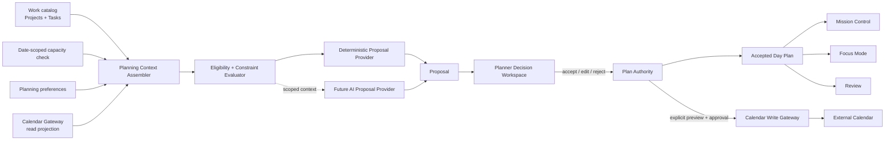
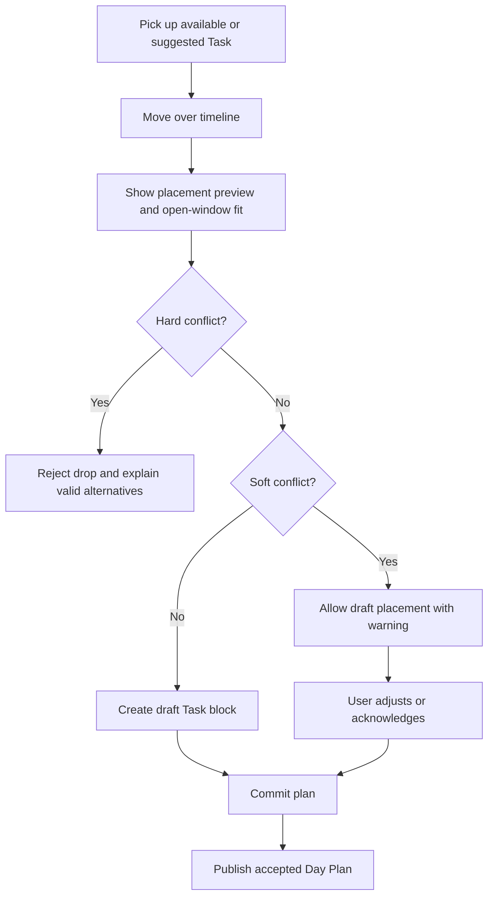
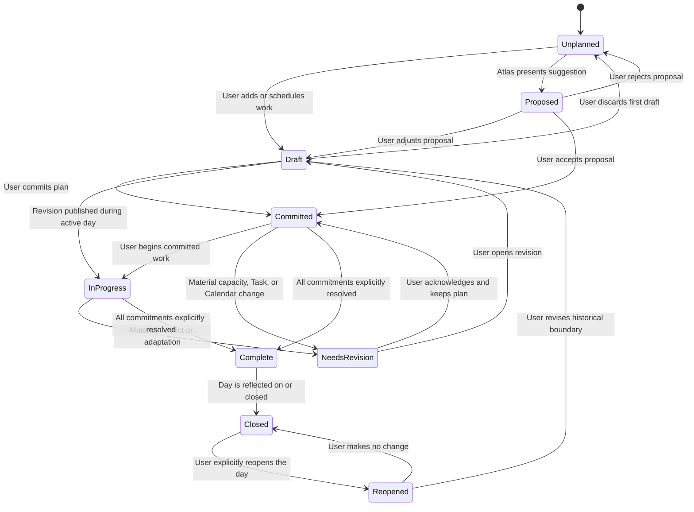
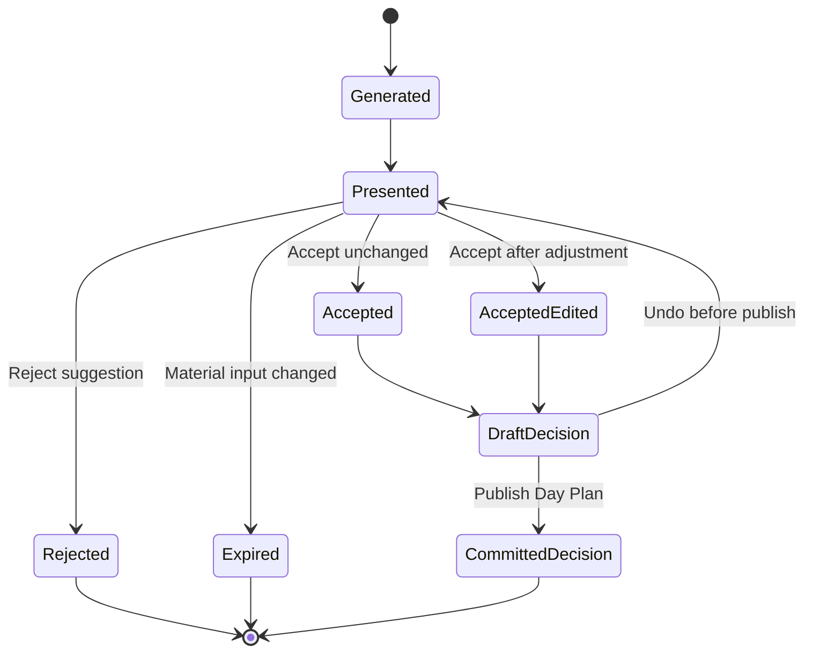
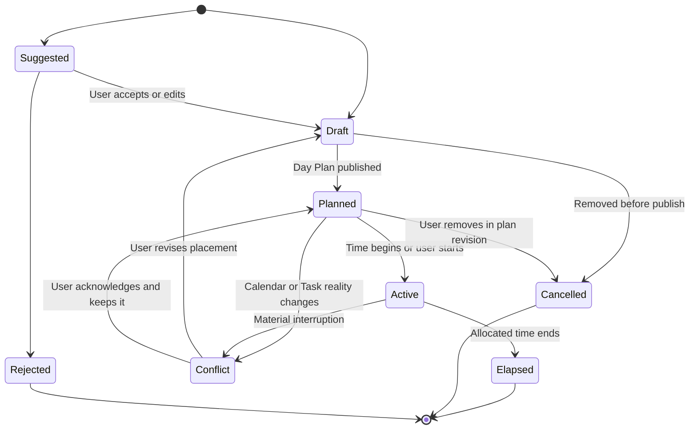
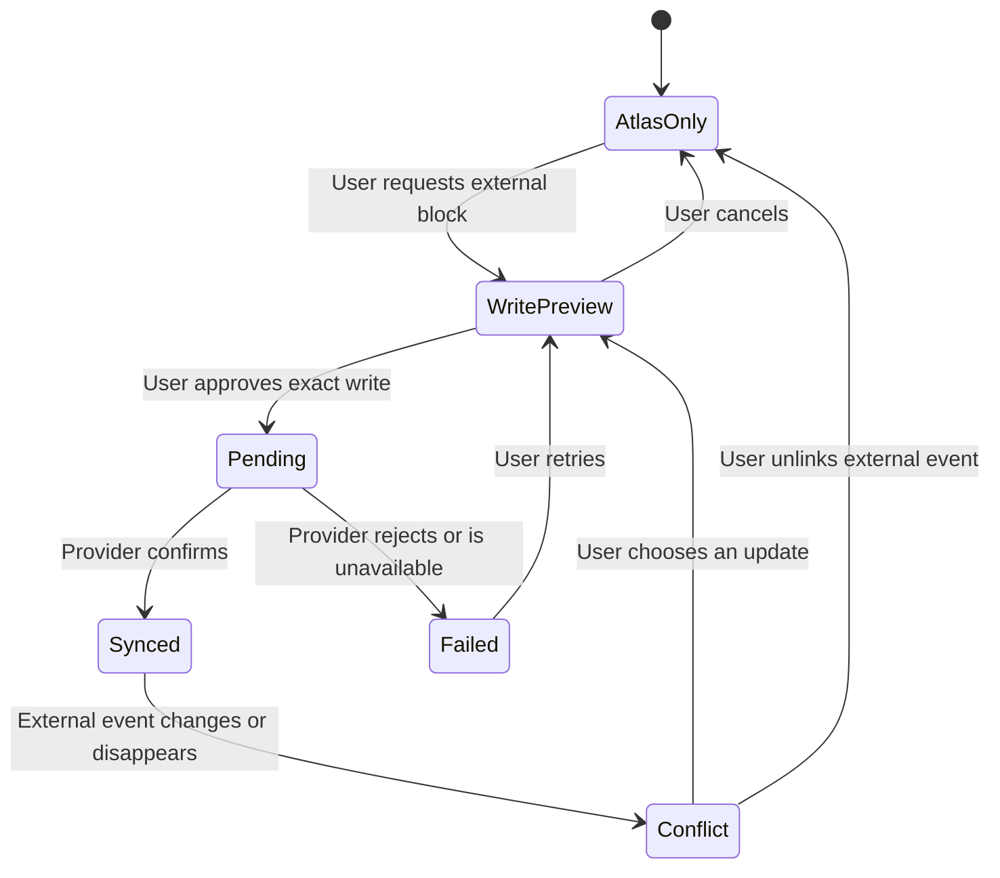
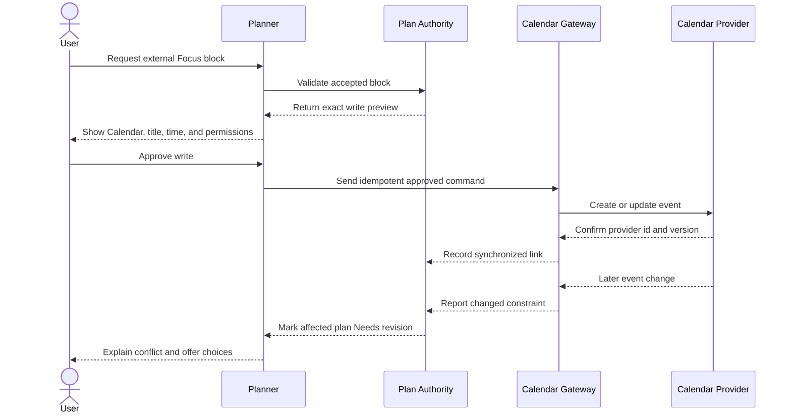
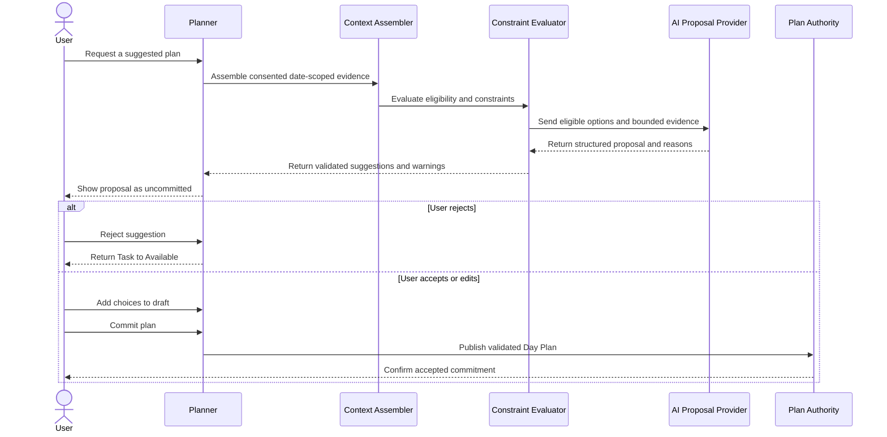

# Atlas Planning Engine Specification

**Sprint:** 6.5.6

**Date:** 2026-08-24

**Status:** Product and architecture specification only

**Implementation:** Out of scope

## Executive decision

The Planning Engine is the decision boundary between **work that could be done** and **work the user has committed to do**.

It combines Project context, actionable Tasks, a date-scoped capacity check, real time constraints, duration, context, and dependencies. It may produce an explained proposal, but it never creates Today or writes to an external Calendar without the user's explicit acceptance.

The default experience is a calm daily planner with two coordinated views:

1. a small candidate tray that separates **Suggested**, **Available**, and **Deferred** work;
2. a day agenda that separates external events, accepted commitments, and unallocated time.

Dragging and resizing are efficient enhancements. Every action also has a keyboard- and touch-friendly command. The planner must remain useful without AI, without a connected Calendar, and without precise Task estimates.

## Goal

The Planner answers one question:

> Given today's reality, what am I committing to?

It should help the user make a credible plan that:

- advances meaningful Project outcomes;
- includes useful standalone Tasks;
- fits genuine open time;
- respects energy, stress, and motivation without grading the user;
- excludes work that cannot move because of unresolved dependencies;
- limits context switching and overcommitment;
- remains understandable and editable;
- becomes the single accepted Today plan projected into Mission Control and Focus Mode.

## Success criteria

A successful planning experience lets the user:

- understand capacity and available time at a glance;
- see why a Task is eligible, suggested, or unavailable;
- distinguish Atlas's proposal from an accepted commitment;
- build or revise a day manually;
- accept or reject suggestions individually or as a plan;
- drag Tasks into time, resize allocations, and create focus blocks;
- perform the same operations without dragging;
- preserve Project outcome context while planning concrete Tasks;
- identify Calendar and dependency conflicts before committing;
- leave with a small, explicit plan that is reflected everywhere else.

## Non-goals

The Planning Engine is not:

- a backlog manager;
- a replacement for Project or Task detail;
- a month-grid Calendar product;
- a time tracker;
- a productivity score;
- an autonomous scheduler;
- an AI chat destination;
- a mechanism that converts events into Tasks;
- a mechanism that treats Projects as executable work;
- a guarantee that a Task is complete when a time block ends.

Project outcomes, Task definitions, Areas, status, and hierarchy remain owned by Work. The Planner reads that truth and owns only planning decisions.

## Current baseline and design gap

Atlas currently has a deterministic Attention Engine, not an explicit planning experience.

- A Daily Review produces an attention budget from energy, stress, and motivation.
- The current engine chooses up to three Tasks based primarily on attention score, energy fit, and switching cost.
- Each active Project contributes at most one calculated next action.
- Mission Control and Focus Mode consume the generated result directly.
- `scheduledDate`, `dueDate`, Task duration, time availability, and Calendar events do not affect the generated focus result.
- Suggested work, accepted work, and deliberately deferred work are not durable, separate decisions.
- Atlas has no persisted day plan, time block, Calendar connection, or Calendar conflict state.
- Dependencies have product meaning but no complete planning representation yet.

The existing rule-based engine is worth preserving as a deterministic recommendation source. It should stop being the authority for Today. The Planning Engine adds the missing user-decision and time-allocation boundaries around it.

## Product principles

1. **Suggestions are not commitments.** Atlas may propose; only the user establishes Today.
2. **Tasks are executable; Projects provide meaning.** A Project never occupies Today or a focus block directly.
3. **Time and attention are separate constraints.** Four open hours do not imply four usable hours of deep attention.
4. **An estimate is not an allocation.** Resizing a time block does not silently rewrite a Task's estimated remaining duration.
5. **A time block is not completion evidence.** The user explicitly completes, adapts, waits, blocks, or defers a Task.
6. **Manual planning is complete.** Calendar and AI improve the experience but are never required.
7. **Constraints are explainable.** Hidden ranking must not make the plan feel arbitrary.
8. **The day has a boundary.** Yesterday's unfinished work returns for a new decision; it does not silently roll into Today.
9. **User edits outrank generated advice.** A proposal can adapt around explicit choices but cannot override them.
10. **Calm comes from hierarchy, not missing context.** Show the evidence needed for a decision and progressively disclose the rest.

## Core language

| Term | Meaning |
| --- | --- |
| **Candidate** | An actionable Task that is eligible to be considered for the selected planning date |
| **Available** | A Candidate that could be chosen but is not part of a current proposal or commitment |
| **Suggested** | A Candidate Atlas proposes, with reasons; it is not yet accepted |
| **Commitment** | A Task the user has explicitly accepted for the selected day |
| **Today** | The set of Commitments for the user's current local date |
| **Scheduled** | Intent to address a Task on a specific date; it is evidence for planning, not automatic Today membership |
| **Due** | The date after which the Task's expected outcome is late |
| **Deferred** | A Task explicitly left out of this plan; its work status does not change unless the user separately changes it |
| **Task estimate** | The current estimate of remaining Task effort in minutes |
| **Time block** | A start and end allocation inside a Day Plan |
| **Task block** | A Time block linked to one Task |
| **Focus block** | Protected time for undistracted work, optionally assigned to a Task |
| **Buffer** | Deliberately uncommitted or protected transition time |
| **External event** | Provider-owned Calendar evidence shown as a constraint |
| **Conflict** | A condition that makes an accepted or proposed placement questionable and requires explanation or revision |
| **Proposal** | A reversible set of suggested Commitments and optional placements |
| **Day Plan** | The date- and time-zone-scoped record of accepted Commitments, ordering, blocks, and explicit deferrals |

### Critical distinctions

```text
Task estimate: 90 minutes remaining
        │
        ├── Task block: 30 minutes today
        ├── Task block: 45 minutes tomorrow
        └── 15 minutes remain unallocated

Elapsed blocks do not complete the Task.
Task completion does not require every estimate minute to have been blocked.
```

A Day Plan may contain an **unscheduled Commitment**. This is useful when time is uncertain, Calendar is unavailable, or the user wants an ordered list rather than a fully time-boxed day. Time placement improves a commitment; it is not required to make one.

### Planning horizons

- **Today** is the decision workspace for the current local day. Only its accepted Commitments become Today.
- **Upcoming** is a short date or week horizon for scheduling intent, capacity awareness, and conflict prevention.
- Work accepted for a future date remains Scheduled intent. It does not acquire Today status early.
- At the future day boundary, Atlas presents prior intent as strong planning evidence and asks the user to confirm or revise it.
- Unfinished work from a past day enters a “decide again” set. It does not roll forward automatically.
- A month view is not part of the primary Planner because it optimizes date browsing rather than attention decisions.

## Ownership and system boundaries

| Concern | Canonical owner | Planner responsibility |
| --- | --- | --- |
| Area | Work | Read as organizational and context evidence |
| Project title, outcome, status, health | Work | Show context; never redefine it |
| Task title, status, estimate, energy, context, dates | Work | Read eligibility and fit; route edits to Task detail |
| Project next action | Work domain | Consider the actionable Task, not the Project |
| Daily capacity check | Planner / Review history | Use the selected date's check-in and disclose freshness |
| Suggestion | Planner | Generate, explain, expire, accept, or reject |
| Today commitment | Planner | Create only after explicit user acceptance |
| Day ordering and time blocks | Planner | Create, revise, and publish |
| Explicit planning deferral | Planner | Record for the plan without silently changing Task status |
| External event | Calendar provider | Read as a projection; retain provider ownership |
| External Calendar write | Calendar provider | Preview and request explicit approval before writing |
| Mission Control | No canonical records | Read the accepted plan and immediate conflicts |
| Focus Mode | Execution context | Read the accepted current and next Tasks |
| Review | Historical interpretation | Read plan evidence after the period closes |
| AI output | No canonical owner before acceptance | Present as a suggestion through normal Planner decisions |

## Planning inputs

The engine assembles a date-scoped **Planning Context**. Missing optional inputs reduce confidence or capability; they do not prevent manual planning.

| Input | Evidence supplied | How it affects planning | If missing |
| --- | --- | --- | --- |
| Selected date and time zone | The correct local day boundary | Scopes check-in, events, scheduled work, and Today | Planning cannot proceed until a date and zone are known |
| Projects | Outcome, status, health, next action, recent movement | Preserves strategic meaning and surfaces stalled outcomes | Standalone Tasks can still be planned |
| Tasks | Status, Area, optional Project, estimate, energy, context, dates | Creates the actionable candidate set | Show an empty Available state |
| Energy | Current capacity for demanding work | Favors compatible intensity and limits high-energy load | Use neutral fit and disclose unknown capacity |
| Stress | Current fragility and recovery need | Increases buffer, reduces switching, and lowers commitment pressure | Use planning defaults |
| Motivation | Current activation signal | May favor a small start or meaningful momentum, without moral judgment | Do not infer it from behavior |
| Attention budget | Date-scoped capacity synthesis | Limits cognitive load and shapes plan variants | Offer manual planning without a capacity fit claim |
| Available time | Planning windows minus hard constraints and protected buffers | Sets the time ceiling for placed work | Allow ordered, unscheduled Commitments |
| Duration | Estimated remaining Task minutes | Supports fit, splitting, and risk explanation | Ask only when placement needs it, or use an explicit time-box |
| Context | Place, tool, person, or mode required | Excludes impossible contexts and reduces switching | Treat as flexible, not as an error |
| Dependencies | Prerequisites and external waits | Excludes or warns on work that cannot move | Mark confidence lower; do not invent readiness |
| Scheduled date | Prior intent | Raises visibility for the selected date | No effect if absent |
| Due date | Deadline risk | Raises urgency and explains risk; does not force commitment | No deadline claim if absent |
| Calendar events | Busy/free state, all-day constraints, travel, event timing | Defines genuine open windows and detects conflicts | Use Atlas-only planning windows |
| Planning preferences | Working hours, buffers, time format, writable Calendar choice | Personalizes presentation and safe defaults | Use conservative local defaults |

### Capacity semantics

Atlas must not collapse capacity into one precise-looking score. The Planner should present three related but distinct quantities:

1. **Calendar-open time:** time inside the user's planning window that is not occupied by a busy event or fixed commitment.
2. **Plannable time:** Calendar-open time after protected breaks, transition buffers, and unavailable contexts.
3. **Attention fit:** a qualitative judgment about the intensity, switching, and number of commitments that current energy, stress, and motivation can support.

```text
Calendar-open time
− protected breaks
− transition and travel buffers
− contextually unavailable windows
= plannable time

Plannable time constrains minutes.
Attention fit constrains cognitive load.
Both must fit; neither is converted into the other.
```

The existing numerical attention budget may remain an engine input, but the primary UI should use a comprehensible band such as **Limited**, **Steady**, or **High**, accompanied by the practical consequence: fewer commitments, lighter work, or capacity for sustained focus.

Energy, stress, and motivation must be used narrowly:

- **Energy** informs intensity fit, not personal worth or expected output.
- **Stress** favors more buffer, fewer switches, and a more resilient plan.
- **Motivation** may favor a low-friction start or an outcome with visible meaning. It must never be interpreted as discipline or reliability.
- A user can always override a fit warning.

### Dependency semantics

A dependency can point to another Task, a Project outcome, a person, an event, or an external input.

- An unresolved **hard dependency** makes the dependent Task unavailable for normal suggestion.
- A **soft dependency** keeps the Task available but adds a warning.
- `Waiting` means an expected external input or event is outstanding.
- `Blocked` means a known obstacle requires intervention.
- Resolving a dependency re-evaluates eligibility; it does not automatically commit the newly available Task.
- A dependency cycle is an exception to surface, never a condition to hide.
- Follow-up work that can advance a dependency may itself be actionable even while the original Task remains blocked.

## Planning outputs

The engine produces proposals and explanations. The user-decision boundary produces the accepted Day Plan.

### Proposal

A Proposal contains:

- the selected date and time zone;
- the Planning Context version or freshness;
- a small ordered set of suggested Tasks;
- optional time placements;
- the reason for each choice;
- important assumptions and unknowns;
- conflicts or fit warnings;
- a lower-capacity alternative when useful;
- the source, such as deterministic rules or future AI;
- an expiry condition when input changes materially.

A Proposal does not change Today, Task status, dates, estimates, or Calendar events.

### Accepted Day Plan

A Day Plan contains conceptually:

- date and time zone;
- revision and lifecycle state;
- accepted Task commitments and their order;
- zero or more time blocks;
- explicit planning deferrals;
- the capacity check used;
- references to relevant Calendar evidence;
- accepted suggestion provenance and explanation;
- conflicts and acknowledgements;
- timestamps needed for history and Review.

The Day Plan references canonical Tasks. It does not copy and fork Task truth. It may retain a small evidence snapshot—such as the reason, estimate, Project outcome, and capacity band at acceptance—so Review can later explain what the user knew when the plan was made.

## Architecture

The names below describe responsibilities and contracts, not required classes, routes, tables, or framework choices.



### 1. Planning Context Assembler

The assembler creates one normalized, immutable view of the selected day. It:

- resolves the user's local date and time zone;
- gathers the correct date-scoped capacity check;
- reads active Projects and eligible standalone Tasks;
- asks the next-action policy for at most one active action per Project;
- gathers scheduled, due, deferred, and unfinished planning evidence;
- reads Calendar projections and their freshness;
- normalizes duration, context, dependencies, and preferences;
- records unknowns instead of replacing them with invented facts.

The Context is versioned or fingerprinted so the UI can detect when a Proposal was based on stale Task, capacity, or Calendar information.

### 2. Eligibility and Constraint Evaluator

The evaluator applies shared domain rules before any recommendation source ranks work. This prevents a future AI provider from redefining what Atlas considers valid.

**Hard exclusions** normally include:

- Completed, Archived, or Someday work;
- Projects themselves;
- Tasks under an inactive Project;
- Tasks with unresolved hard dependencies;
- Blocked and Waiting Tasks that cannot move;
- contexts known to be impossible in the selected window;
- placements that overlap a non-overridable busy event.

**Soft constraints** produce a warning or lower preference:

- uncertain duration;
- energy mismatch;
- excessive context switching;
- a crowded or fragmented day;
- tentative events;
- stale Calendar data;
- an estimate larger than any available window;
- a Task scheduled on another date;
- unresolved low-confidence dependency information.

Hard and soft treatment must be visible. The user may inspect exclusions and may override soft constraints. A hard domain truth such as Completed cannot be overridden from Planner; the user must edit the Task canonically.

### 3. Proposal providers

All recommendation sources satisfy the same conceptual contract:

```text
Planning Context + evaluated constraints
                    ↓
Explained Proposal with zero state changes
```

The deterministic provider is the baseline and fallback. A future AI provider may offer a better proposal, but both produce the same kinds of suggestion, reason, assumption, warning, and alternative. Neither receives repository or Calendar-write authority.

### 4. Planner Decision Workspace

The workspace makes the source of each object visible:

- provider-owned Calendar events are constraints;
- Atlas-generated blocks are suggestions;
- user-created or accepted blocks are draft decisions;
- the published Day Plan is the accepted commitment.

It supports manual construction without first generating a proposal. UI edits affect a recoverable draft revision. Mission Control continues to show the last accepted Plan until the user publishes the revision.

### 5. Plan Authority

The Plan Authority is the only boundary that can establish or revise a Day Plan. It:

- validates that referenced Tasks still exist and are actionable;
- checks the Proposal's input freshness;
- records accepted, edited, rejected, and explicitly deferred decisions;
- publishes a revision atomically;
- keeps Task status and block lifecycle distinct;
- exposes the accepted projection to Mission Control, Focus Mode, and Review;
- coordinates an optional Calendar write only after explicit approval.

Publishing a plan may project its current-date commitments as Today, but Today must have this one source of truth. Other features do not infer or manufacture it independently.

### 6. Calendar gateways

Calendar reads and writes use separate conceptual permissions:

- the **Read Gateway** normalizes provider-owned events into constraints;
- the **Write Gateway** receives only an already approved write command;
- a provider adapter handles provider-specific recurrence, identifiers, tokens, and synchronization;
- the Planner works against normalized Calendar projections rather than provider objects.

### 7. Projections

The accepted Day Plan is projected into:

- **Mission Control:** accepted commitments, immediate time constraint, and material conflict;
- **Focus Mode:** current and next committed Task;
- **Project workspace:** planning relevance of that Project's Tasks, without changing Project ownership;
- **Review:** what was committed, adapted, completed, deferred, or left unresolved;
- **Upcoming:** future scheduled intent, without calling future work Today.

## Deterministic planning policy

The baseline provider should be simple, testable, and explainable. It is a sequence of constrained decisions, not a claim to find the mathematically perfect day.

### Pass 1 — establish reality

1. Resolve the selected local date and time zone.
2. Load the matching capacity check and label it current, missing, or stale.
3. Build Calendar-open and plannable windows.
4. Preserve any already accepted Commitments as fixed input unless the user is explicitly revising them.

### Pass 2 — form the candidate set

1. Include active standalone Tasks.
2. Include at most the current next action from each active Project.
3. Surface Tasks scheduled for the selected date.
4. Surface due and overdue risk as evidence.
5. Keep Blocked, Waiting, and dependency-bound work in an exception set, not the candidate set.

### Pass 3 — evaluate fit

For every Candidate, evaluate:

- outcome importance and attention score;
- due and scheduled evidence;
- Project health and recent movement;
- energy fit;
- duration fit in genuine open windows;
- required context;
- switching cost relative to other choices;
- dependency readiness;
- estimate certainty.

### Pass 4 — construct a small proposal

1. Protect buffers before packing work.
2. Prefer meaningful outcome movement over filling every free minute.
3. Cluster compatible context when it does not hide urgent work.
4. Avoid proposing more simultaneous commitments than the capacity band supports.
5. Split a Task only into explicit time-boxes; do not change its estimate.
6. Leave spare capacity when fit is uncertain.
7. Return an empty Proposal when nothing credibly fits.

### Pass 5 — explain

Every suggestion answers:

- Why this Task?
- Why today?
- Why this duration or placement?
- Which evidence mattered?
- What is uncertain?
- What was intentionally left out?

Example explanations:

- “Moves **Atlas available from every device**; due tomorrow; fits the 45-minute open window.”
- “Low-energy administrative Task grouped with two calls in the same context.”
- “Suggested as a 25-minute start; the 90-minute estimate does not fit as one block.”
- “Not suggested: waiting for supplier confirmation.”

### Constraint precedence

| Priority | Constraint or choice | Behavior |
| --- | --- | --- |
| 1 | Canonical Task truth and hard dependency state | Never bypass in a proposal |
| 2 | Explicit user locks, accepted blocks, and protected time | Preserve until the user edits them |
| 3 | Busy Calendar events and unavailable windows | Prevent placement unless explicitly overridable |
| 4 | Due risk and selected-date scheduled intent | Strong planning evidence, not automatic commitment |
| 5 | Time and attention fit | Shape load, duration, buffers, and alternatives |
| 6 | Project outcome importance and health | Favor meaningful movement |
| 7 | Context clustering and switching cost | Improve the plan after higher constraints fit |
| 8 | Stable tie-breakers | Keep repeated proposals predictable |

When two constraints cannot both be satisfied, Atlas should not silently choose. It presents the conflict, its consequence, and a small set of valid options.

## Planner UI

### Primary hierarchy

1. **Day orientation:** date, plan state, capacity band, plannable time, Calendar freshness.
2. **Accepted or draft plan:** what the user is actually deciding.
3. **Suggestions and available work:** alternatives with concise reasons.
4. **Timeline evidence:** external constraints, open windows, buffers, and time blocks.
5. **Exceptions:** conflicts, dependencies, and stale inputs requiring intervention.

The default view is **Today**. Upcoming offers a short agenda or week horizon for scheduling intent; it is not a dense month grid.

### Desktop wireframe

```text
┌────────────────────────────────────────────────────────────────────────────┐
│ Planner   ‹  Monday · 24 August  ›       Steady attention · 4h 10m open   │
│ Plan: Draft · Calendar updated 2m ago       [Discard] [Commit today's plan]│
├──────────────────────────────┬─────────────────────────────────────────────┤
│ TODAY'S COMMITMENT           │ 08:00                                      │
│ 1  Write migration outline   │ ┌─────────────────────────────────────────┐ │
│    Atlas → available…        │ │ Team meeting · External · Busy          │ │
│ 2  Call electrician          │ └─────────────────────────────────────────┘ │
│                              │ 10:00  ───────── open 45m ───────────────  │
│ SUGGESTED                    │ ┌ ┄ ┄ ┄ ┄ ┄ ┄ ┄ ┄ ┄ ┄ ┄ ┄ ┄ ┄ ┄ ┄ ┄ ┄ ┐ │
│ ┌──────────────────────────┐ │ ┊ Write migration outline · 45m          ┊ │
│ │ Write migration outline │ │ ┊ Suggested · Due tomorrow               ┊ │
│ │ 45m · Energy 4 · Office  │ │ └ ┄ ┄ ┄ ┄ ┄ ┄ ┄ ┄ ┄ ┄ ┄ ┄ ┄ ┄ ┄ ┄ ┄ ┄ ┘ │
│ │ Due tomorrow · Why?      │ │ 12:00  ───────── protected break ──────  │
│ │ [Accept] [Reject]        │ │ ┌─────────────────────────────────────────┐ │
│ └──────────────────────────┘ │ │ Focus block · Unassigned · 60m         │ │
│                              │ └─────────────────────────────────────────┘ │
│ AVAILABLE  8                │ 15:00  ───────── open 90m ───────────────  │
│ Search or filter context     │                                             │
│ ○ Call electrician · 20m    │ [+ Add focus block]   [View conflicts 1]    │
│ ○ Prepare samples · 60m     │                                             │
│                              │ Selected block details open on demand,     │
│ DEFERRED  2                  │ never as a permanent competing sidebar.    │
└──────────────────────────────┴─────────────────────────────────────────────┘
```

Design decisions:

- The accepted or draft commitment appears before suggestions so Atlas does not visually own the day.
- The candidate tray is narrower than the timeline and contains only decision-ready metadata.
- Project title and outcome remain visible beneath a Project Task.
- Suggested placements use a non-color distinction such as a dashed outline and a “Suggested” label.
- Accepted blocks use the single green accent; external events remain neutral.
- The inspector opens only when an Item or block is selected. There is no permanent AI panel.
- Empty time is visually quiet. The interface does not pressure the user to fill it.

### Tablet wireframe

```text
┌──────────────────────────────────────────────────────────────┐
│ Planner · Mon 24 Aug      Steady · 4h 10m      [Commit plan]│
├──────────────────────────────────────────────────────────────┤
│ [Plan] [Suggestions 3] [Available 8] [Deferred 2]           │
│                                                              │
│ TODAY'S COMMITMENT                                           │
│ 1  Write migration outline · 45m · Atlas                    │
│ 2  Call electrician · Anytime                               │
│                                                              │
│ 08:00  Team meeting · External                               │
│ 10:00  ┌ ┄ Suggested: Write outline · 45m ┄ ┐              │
│ 12:00  Protected break                                      │
│ 13:00  Focus block · 60m                                    │
│                                                              │
│ [Add work] [Add focus block] [Conflicts 1]                   │
└──────────────────────────────────────────────────────────────┘
```

On tablet, the candidate tray becomes a tab or dismissible drawer. The timeline and accepted plan stay in the main reading flow.

### Mobile wireframe

```text
┌──────────────────────────────┐
│ ‹  Mon · 24 Aug  ›           │
│ Steady attention             │
│ 2h 35m plannable             │
│ Draft changes                │
│ [Commit today's plan]        │
├──────────────────────────────┤
│ TODAY'S COMMITMENT           │
│ 1  Write migration outline   │
│    Atlas · 45m · 10:15       │
│ 2  Call electrician          │
│    Home · Anytime            │
├──────────────────────────────┤
│ AGENDA                       │
│ 09:00  Team meeting          │
│ 10:15  Write outline · 45m   │
│ 12:00  Break                 │
│ 14:00  Focus block · 60m     │
│                              │
│ [Schedule work]              │
│ [Create focus block]         │
├──────────────────────────────┤
│ SUGGESTED  2       [View]    │
│ Due tomorrow · fits 30m…     │
│ [Accept] [Reject]            │
└──────────────────────────────┘
```

Mobile uses an agenda first. Touch dragging may be offered when reliable, but the primary path is **Schedule work**, which opens a bottom sheet with Task, date, start, duration, and conflict feedback. Resizing uses explicit duration and start/end controls. Nothing important depends on precise finger movement on a narrow timeline.

## Interaction model

### Build a plan manually

1. Open Available.
2. Choose a Task.
3. Select **Add to today** for an unscheduled Commitment, or **Schedule** for a Task block.
4. Atlas previews capacity, dependency, and time conflicts.
5. The change enters the draft revision.
6. Publish with **Commit today's plan**.

Manual planning never requires generating or accepting suggestions.

### Drag a Task



Dropping a Suggested Task accepts that suggestion **into the draft**. It does not publish Today until the user commits the plan.

### Resize a time block

- Drag either edge to change the allocation.
- Snap visually to a user-appropriate interval while allowing precise keyboard or form entry.
- Show start, end, and allocated minutes during the change.
- Re-evaluate overlap, buffer, and attention fit live.
- Preserve the Task estimate.
- If the allocation now exceeds or materially contradicts the estimate, offer a separate **Update Task estimate** action; never apply it implicitly.
- Permit splitting one Task across multiple blocks.

### Time-box work

The user may choose a shorter block than the Task estimate. Atlas describes it as a start or continuation, not as planned completion.

At block end, the user may:

- continue in a new block;
- explicitly complete the Task;
- record progress and leave it available;
- block or wait the Task;
- defer the remaining work for a new planning decision.

No automatic timer or passive time tracking is required.

### Create a focus block

A Focus block can be created by selecting an open window, dragging across empty time on larger screens, or choosing **Create focus block**.

- It protects a period for undistracted work.
- It may be assigned to a Task immediately or left unassigned.
- An unassigned Focus block does not create a Task.
- Entering Focus Mode from the block requires selecting an actionable Task.
- Publishing it to an external Calendar is a separate, explicit choice.
- Removing it changes the Day Plan, not the underlying Task.

### Accept a suggestion

The user can:

- accept one Task without its proposed time;
- accept one Task and placement;
- accept as edited;
- accept an entire proposal;
- use the proposal only as a reference and plan manually.

Acceptance validates current inputs. If a dependency, Task, capacity check, or Calendar event changed, Atlas explains what became stale before publishing.

### Reject a suggestion

Rejecting:

- removes the suggestion from the current Proposal;
- does not delete, archive, complete, block, or reschedule the Task;
- normally returns an otherwise eligible Task to Available;
- may record an optional reason such as wrong priority, wrong energy, insufficient time, wrong context, or not today;
- does not become a permanent preference or AI-training signal without explicit consent.

**Defer from this plan** is a separate explicit action. It records an intentional planning decision and remains visible in Deferred.

### Revise an accepted plan

1. Open Planner from Mission Control or a conflict.
2. Atlas keeps the last accepted Plan visible and creates a draft revision.
3. Move, add, remove, or resize work.
4. Review any changed capacity or Calendar evidence.
5. Publish the revision, or discard it and preserve the accepted Plan.

This staging prevents half-finished edits from leaking into Mission Control or Focus Mode.

### Conflict resolution

| Conflict | Planner response | User choices |
| --- | --- | --- |
| External event overlaps a Task block | Mark the placement and plan Needs revision; do not move it | Move work, shorten it, keep with acknowledgement where allowed, or remove it |
| Energy or stress changes materially | Recalculate fit without changing Today | Keep plan, choose a lighter alternative, or revise manually |
| Task becomes Blocked or Waiting | Remove it from executable Focus projection and flag the commitment | Adapt status, replace it, or revise the plan |
| Dependency is no longer satisfied | Mark Task unavailable and explain the prerequisite | Resolve dependency, choose follow-up work, or remove it |
| Task estimate grows | Show that allocated time no longer covers the estimate | Add time, time-box a first step, or keep current allocation |
| Calendar data is stale | Label time fit as uncertain | Refresh, continue without Calendar confidence, or switch to unscheduled planning |
| Proposal input changes before acceptance | Mark Proposal stale | Refresh proposal or continue manually |
| Two local edits conflict | Preserve the accepted revision and both recoverable drafts | Choose which revision to publish; never silently merge time blocks |

## State model

The state model separates planning, suggestion, block, Task, and Calendar-sync lifecycles. Similar words must not imply shared state.

### Day Plan lifecycle



For an already accepted plan, a new Draft is a **revision alongside** the current committed revision. It does not replace the committed revision until publish.

### Suggestion lifecycle



Rejected and expired suggestions have no work-state side effects.

### Time block lifecycle



`Elapsed` says only that the allocated window ended. The linked Task may still be Active, Today, Waiting, Blocked, Completed, or otherwise explicitly updated through its own lifecycle.

### Calendar write lifecycle



### State ownership matrix

| State change | May happen automatically | Requires explicit user decision |
| --- | --- | --- |
| Recalculate a Proposal | Yes, while preserving the old Proposal long enough to explain the change | No |
| Mark Proposal stale | Yes | No |
| Establish or revise Today | No | Yes |
| Add, move, resize, or remove a draft block | Only as a direct UI consequence of the user's action | Yes |
| Move an accepted block after Calendar change | No | Yes |
| Complete a Task | No | Yes |
| Change a Task estimate after resizing | No | Yes, as a separate Task edit |
| Mark a Calendar sync failed or conflicted | Yes | No |
| Write, update, or delete an external Calendar event | No | Yes, with preview |
| Carry unfinished work into a new day | No | Yes |

### Transient UI state

Selected date, open candidate tab, expanded explanation, focused card, inspector or sheet state, drag preview, resize preview, filters, and timeline zoom are interface state. They are not part of the accepted Day Plan.

A recoverable planning Draft is different: it represents an unfinished user decision and should survive an interruption. The implementation may choose how to persist it, but it must remain clearly separate from the last published Plan.

## Future Calendar integration

### Integration posture

Calendar is a Planner capability, not a new Atlas work system. External events remain provider-owned. Atlas defaults to read-only constraints and works when disconnected.

### Normalized Calendar projection

The Planner needs a provider-neutral projection containing only planning-relevant evidence:

- provider and external event identifier;
- source Calendar and current permission level;
- start, end, original time zone, and normalized display zone;
- all-day, recurring-instance, busy/free, tentative, and cancelled semantics;
- user-editable versus read-only capability;
- travel or buffer evidence when available and permitted;
- last synchronized time and freshness;
- privacy-safe display label according to granted access.

Provider recurrence objects, credentials, and proprietary fields stay behind the adapter boundary.

### Read behavior

- Read the smallest date range needed for Today or the visible Upcoming horizon.
- Support free/busy-only access when event details are not required or permitted.
- Treat all-day events according to busy/free semantics rather than automatically blocking the whole day.
- Expand recurring instances at the adapter boundary and retain the series/instance identity needed for conflict handling.
- Normalize daylight-saving transitions, travel, and cross-time-zone events before computing windows.
- Show freshness when Calendar evidence may be stale.
- Never create a Task from an event automatically.

### Write behavior

Atlas may offer to publish a Task or Focus block only after the user asks. Before every first write or materially changed write, preview:

- target Calendar;
- title and privacy level;
- start, end, and time zone;
- reminders if any;
- whether later Atlas edits will offer to update the linked event.

The user then approves the exact external effect. Atlas stores a link between the accepted block and provider event so retries are idempotent and do not create duplicates.

Deleting a Task or changing Task status never silently deletes an external event. Atlas asks whether to update, unlink, or remove the provider event.

### Calendar conflict policy



Provider changes never silently move Atlas work. Atlas may suggest alternatives, but the user resolves the accepted plan.

### Failure and offline behavior

- Calendar read failure leaves Atlas Tasks and the accepted Plan usable.
- Unverified open time is labeled uncertain, not displayed as safely available.
- A failed write preserves the Atlas block and exposes retry, edit, or keep Atlas-only.
- Idempotency prevents retry duplicates.
- Revoked permission stops synchronization and explains which linked blocks remain Atlas-only.
- A provider outage does not prevent manual, unscheduled planning.

## Future AI integration

### Role

AI may improve proposal quality and explanation. It is one Proposal Provider behind the same constraint and user-decision boundaries as deterministic rules.

AI can:

- propose a small daily plan;
- explain tradeoffs in plain language;
- offer Essential, Balanced, or Spacious variants when genuinely useful;
- identify overcommitment, fragmentation, or due-date risk;
- propose context clusters and buffers;
- suggest splitting an estimated Task into explicit time-boxes;
- flag missing duration, context, or dependency evidence;
- offer alternative placement after a conflict;
- summarize relevant Project outcome context.

AI cannot:

- create Today;
- complete, delete, archive, block, or wait a Task;
- change Task duration, dates, Area, Project, outcome, or dependency state;
- create, move, or delete an external Calendar event;
- bypass eligibility and hard constraints;
- read arbitrary notes or external event details without the user's configured consent;
- learn a durable personal preference from rejection without permission;
- hide the deterministic manual fallback.

### AI request boundary

The request should include only the evidence needed for the visible planning decision:

- selected date, time zone, and planning window;
- current capacity signals and user-visible notes when consented;
- eligible Task metadata;
- Project title, outcome, next-action context, and health;
- duration, energy, context, dates, and dependencies;
- Calendar free/busy constraints, with private titles omitted unless needed and permitted;
- user locks, accepted blocks, buffers, and planning preferences.

The request includes a stable context version. The response must identify assumptions, uncertainty, and the evidence used for each suggestion.

### AI response boundary

AI returns structured proposals, not commands:

- suggested Task references;
- optional placement and time-box length;
- concise reasons;
- assumptions and confidence;
- conflicts and missing inputs;
- alternatives;
- no mutation instructions that can execute without validation and consent.

The same domain evaluator validates AI output. A response referencing a stale, ineligible, nonexistent, or provider-owned object is rejected or downgraded to explanation only.

### AI interaction



### Trust, privacy, and learning

- Clearly label rule-based and AI-generated suggestions.
- Show “Why?” next to each suggestion without requiring a chat.
- Keep prompt context inspectable at a useful human level.
- Do not send Calendar event titles when free/busy data is sufficient.
- Store acceptance provenance for explanation and Review, not performance scoring.
- Treat rejection reasons as local decision evidence by default.
- Require explicit opt-in before using decisions for durable personalization or model improvement.
- When AI is unavailable, preserve the draft, use deterministic suggestions, and keep every manual action available.

## Responsive behavior

| Capability | Desktop | Tablet | Mobile |
| --- | --- | --- | --- |
| Candidate access | Persistent narrow tray | Tab or drawer | Bottom sheet or stacked section |
| Day view | Vertical timeline | Vertical timeline | Agenda-first list |
| Drag | Primary efficiency path | Optional | Enhancement only |
| Schedule without drag | Dialog or inspector | Sheet | Primary sheet |
| Resize | Handles plus fields | Handles plus fields | Explicit start/end/duration fields |
| Suggestion details | Inline expansion or temporary inspector | Sheet | Sheet |
| Plan publish | Sticky header action | Sticky header action | Sticky bottom or top action, respecting safe area |
| Conflicts | Inline on affected block and summary | Inline and summary | Compact summary with affected agenda row |

The semantic reading order is always: day orientation, commitment, agenda, suggestions, available work, deferred work, conflicts. CSS layout may place the candidate tray beside the timeline on wider screens without changing that logical order.

## Accessibility and keyboard model

Drag-and-drop is never the only way to plan.

- Every Task exposes **Add to today**, **Schedule**, **Defer**, and **Open Task** actions.
- Every block exposes **Move**, **Change duration**, **Unassign**, and **Remove from plan** actions.
- Space may pick up and drop a focused draggable object; arrow keys move a picked-up block; Escape cancels.
- When a block is selected, clearly labeled controls adjust start, end, and duration. Keyboard resizing must not depend on a pointer handle.
- Movement announcements include Task, start, end, duration, and conflict state through an appropriate live region.
- Focus returns to the initiating control after closing a sheet or inspector.
- Suggested, accepted, external, conflicted, and blocked states use labels, structure, and icons in addition to color.
- Resize handles and touch targets meet comfortable pointer sizes.
- Timeline zoom, contrast, and text size do not make precise dragging mandatory.
- Localized date, time format, first day of week, and time zone are respected.
- Motion is restrained and reduced-motion preferences remove nonessential transitions.
- Single-key shortcuts never activate while typing and are documented in context.

## Empty, loading, and degraded states

| State | Message and behavior |
| --- | --- |
| No Tasks | “Nothing is available to plan yet.” Offer Capture or Work, without fake work |
| No Project next actions | Explain which active Projects need a next action; do not suggest the Projects themselves |
| No check-in | “Plan without a check-in” remains available; capacity fit is labeled unknown |
| No Calendar connection | Show Atlas scheduling and an optional route to Settings; do not block planning |
| No open time | Keep unscheduled planning available and explain the Calendar constraint |
| No credible suggestion | “No plan fits confidently. Build today manually or change the window.” |
| No duration | Keep Task available; request an estimate only when time placement requires it |
| All candidates blocked | Surface the smallest useful intervention set, not an empty recommendation |
| Loading Calendar | Keep accepted Plan and work visible; mark availability as loading |
| Stale Proposal | Preserve user edits; explain what changed and offer refresh |
| Proposal failure | Keep deterministic and manual paths available |
| Calendar failure | Keep Atlas-only blocks usable and label time confidence |
| Draft interrupted | Restore the recoverable draft and distinguish it from the accepted Plan |
| New day | Open an Unplanned context and ask what to do with unfinished work |

## Information shown on planning cards

Default Task cards should show only decision-relevant evidence:

- Task title;
- Project title and outcome, or Area for a standalone Task;
- estimated duration or “No estimate”;
- energy level;
- required context when present;
- scheduled or due evidence using distinct language;
- dependency, Waiting, or Blocked reason when relevant;
- concise suggestion reason and source when Suggested.

Description, tags, full hierarchy, edit controls, and history are progressively disclosed or opened in canonical Task or Project detail.

## Planning consistency across screens

| Screen | What it reads from Planner | What it may change |
| --- | --- | --- |
| Mission Control | Accepted Today Commitments, ordering, current block, next Calendar constraint, material conflicts | Complete or adapt a Task; broad revision returns to Planner |
| Focus Mode | Current and next accepted Task plus essential Project outcome | Explicit Task completion or adaptation; no broad replanning |
| Project workspace | Whether Project Tasks are available, suggested, committed, or scheduled | Task and Project truth; “Plan this” opens Planner |
| Task detail | Planning references and block summary | Task truth; a planning change routes through Plan Authority |
| Review | Capacity used, accepted plan, adaptations, completion, and deferral | Reflection and explicit corrections through canonical screens |
| Upcoming | Scheduled intent and future accepted blocks | Future scheduling intent; never current Today without date boundary confirmation |

## Key design decisions and tradeoffs

| Decision | Why | Tradeoff |
| --- | --- | --- |
| Day Plan is explicit and durable | Gives Today one meaning and enables Review | Requires a new planning concept beyond generated FocusPlan |
| Commitment and placement are separate | Planning still works without Calendar or precise time | Some Today Tasks may not appear in a clock slot |
| Task estimate and block duration are separate | Prevents resizing UI from corrupting work truth | Remaining effort needs deliberate updates |
| Deterministic rules remain the baseline | Keeps behavior testable, explainable, and available offline from AI | Initial proposals may be less nuanced |
| AI uses the same Proposal contract | Prevents a parallel AI-owned planning system | Constrains free-form AI behavior |
| Calendar is read-only by default | Preserves ownership and trust | Publishing focus blocks takes an extra approval step |
| Draft revisions publish atomically | Prevents half-edited plans appearing elsewhere | Adds visible Draft versus Committed state |
| Drag is optional | Preserves accessibility and mobile usability | More command surfaces are required |
| Timeline is day-first, not a month grid | Keeps the question on credible commitment | Long-range portfolio scheduling remains outside this surface |
| Empty time stays empty | Avoids optimization pressure and supports resilience | The planner does not maximize utilization |
| Rejection is not deferral | Preserves the difference between disliking a suggestion and making a planning decision | Two actions must be explained clearly |
| External events and Tasks never auto-convert | Avoids duplicate ownership | Users must explicitly link work and time |

## Decisions intentionally left open for implementation discovery

This specification does not choose:

- route names or component structure;
- database tables or migration shape;
- the Calendar provider sequence;
- the exact time-grid snap interval;
- the precise capacity-band thresholds;
- the visual icon set;
- whether drafts autosave locally, remotely, or both;
- the first AI model or provider;
- recurrence for Atlas-created focus blocks;
- notifications or reminders.

Those choices must preserve the ownership, state, consent, accessibility, and semantic boundaries defined here.

## Specification acceptance checklist

- [x] Calendar, Projects, Tasks, capacity, available time, duration, context, and dependencies have explicit roles.
- [x] Energy, stress, and motivation affect fit without becoming productivity scores.
- [x] Available, Suggested, Committed, Scheduled, Due, and Deferred have distinct meanings.
- [x] Projects remain visible as outcome context but never become executable Today Items.
- [x] Dragging, resizing, time-boxing, and Focus block creation are specified.
- [x] Keyboard and mobile alternatives exist for every pointer interaction.
- [x] AI acceptance and rejection preserve user authority.
- [x] Calendar reads and writes preserve external ownership and explicit consent.
- [x] Day Plan, suggestion, block, Task, and sync states remain separate.
- [x] Mission Control and Focus Mode consume only accepted planning state.
- [x] Manual and deterministic planning remain complete without AI or Calendar.
- [x] No implementation, persistence migration, or UI code is included in this sprint.

## Final product model

```text
Work defines what exists.
Daily check-in describes today's capacity.
Calendar describes real time constraints.
The Planning Engine assembles and explains credible options.
The user commits.
Mission Control shows the commitment.
Focus Mode protects execution.
Review learns from what happened.
```

The Planning Engine succeeds when the user leaves with confidence, not a perfectly packed calendar. It should reduce the cost of deciding while preserving the user's authority over attention, time, and external commitments.
