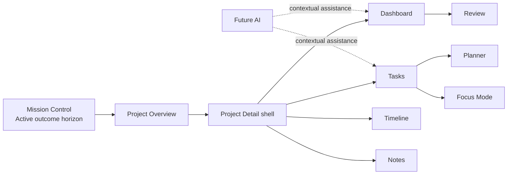

# Atlas Project Workspace Specification

**Sprint:** 6.5.4
**Date:** 2026-08-24
**Status:** Product and interaction specification only. This document does not prescribe implementation.

## Purpose

Projects are first-class outcomes in Atlas. They are not hidden folders behind Tasks and they are not merely labels attached to work. The Project experience should let the user maintain a continuous horizon across larger commitments while still making the next concrete action obvious.

The workspace must answer three questions at different zoom levels:

1. **Project Overview:** Which outcomes exist, and which need attention?
2. **Project Dashboard:** What is true about this outcome right now?
3. **Project detail views:** What work, time, context, or history needs inspection?

Projects never appear as executable work in Today or Focus Mode. Their actionable Tasks do. Wherever a Project Task appears, its Project outcome remains available as context.

## Product principles

1. **Outcome before activity.** The Project exists to make an outcome true, not to accumulate Tasks.
2. **Continuous visibility.** Every active Project remains represented in the Project Overview and Mission Control horizon. Atlas does not silently show only a favored subset.
3. **One next action.** A Project may contain much future work, but one Task is explicitly identified as the current next action.
4. **Exceptions before metrics.** Missing next actions, blockers, waiting conditions, date risks, and dormancy matter more than raw counts.
5. **Progress means outcome movement.** Task completion is evidence, not the definition of Project progress.
6. **Small Projects stay small.** Empty milestones, dependency panels, timelines, and notes do not appear merely because the system supports them.
7. **Large Projects remain scannable.** Milestones, sections, dependencies, and history summarize complexity rather than exposing one enormous Task list.
8. **Project maintenance is not daily planning.** The workspace defines available work; Planner owns suggestions and Today commitments.
9. **Personal and Work Projects share one model.** Area and content provide context without introducing separate enterprise and personal workflows.
10. **AI remains advisory.** It can clarify and propose, but it never silently changes the Project or its Tasks.

## Visibility contract across Atlas

Projects must remain visible beyond their own workspace:

| Place | Project representation |
| --- | --- |
| Mission Control | Compact active-outcome row with title, outcome, health, and next action or exception |
| Work | Projects is the default collection and canonical home for every Project state |
| Planner | Each Project Task retains Project title and outcome context; the Project itself is never committed |
| Focus Mode | Current Task includes only enough Project outcome context to preserve meaning |
| Review | Project movement, exceptions, and outcome decisions provide the weekly horizon |
| Inbox | Project creation is one clear exit from processing, without requiring a first Task |
| Search | Project title, outcome, Area, notes, and related Tasks resolve to the canonical workspace |

Mission Control should not use a carousel, random “top Projects,” or an unexplained limit. If the active set is too large to remain calm, Atlas should make that condition visible and help the user decide which outcomes are truly active. It should not hide the excess.



## Project concepts

### Project identity

Every Project has:

- a concise title;
- one Area;
- a required outcome;
- an intentional lifecycle state;
- zero or more Tasks;
- zero or one current next action;
- optional description, dates, milestones, dependencies, and notes.

The title names the effort. The outcome states what will be true when the effort succeeds. The description supplies useful boundaries or context and should not duplicate the outcome.

### Lifecycle, health, and progress

These are separate concepts:

| Concept | Decided by | Purpose | Examples |
| --- | --- | --- | --- |
| **Lifecycle** | User | Express intentional Project state | Active, Waiting, Blocked, Someday, Completed, Archived |
| **Health** | Atlas observation, confirmed or corrected by user | Surface a condition needing attention | Moving, Needs next action, At risk, Dormant |
| **Progress** | Outcome evidence | Explain what has materially changed | Milestone achieved, decision made, deliverable accepted |

Atlas must not present a dense pile of lifecycle, health, progress, and priority badges. The interface shows one intentional state and, when necessary, one plain-language exception.

### Dormant is not a hidden status

A dormant Project is still intentionally Active but has shown no meaningful movement, has no upcoming commitment, or has repeatedly failed to produce an actionable next step. Dormancy is an advisory health signal, not an automatic lifecycle change.

A dormant Project remains visible under **Needs attention** and during Weekly Review. The available decisions are:

- Resume;
- clarify or reframe the outcome;
- define a next action;
- move to Someday;
- complete if the outcome is already true;
- archive if it is no longer relevant.

Atlas never moves a Project to Someday or Archive solely because time passed.

## Workspace hierarchy

```text
Work
└── Projects                         Project Overview
    └── One Project                  Project Detail shell
        ├── Dashboard                Default decision view
        ├── Tasks                    Action structure
        ├── Timeline                 Upcoming and historical movement
        └── Notes                    Project memory
```

Dependencies, Waiting, and Blocked are not separate top-level tabs. They are exception lenses inside Dashboard, Tasks, and Timeline. This keeps Project navigation stable while ensuring important constraints remain visible.

## Project Overview

### Screen contract

**Primary question:** Which outcomes exist, and which one needs attention?

**Primary action:** Create Project.

**Secondary actions:** Search, filter, change view, and open a Project.

**Does not do:** Edit Tasks inline, display every metric, or plan Today.

### Information hierarchy

1. Page identity and Create Project action.
2. Project-state views: Active, Needs attention, Someday, Completed.
3. A compact **Needs attention** collection when exceptions exist.
4. All active Projects grouped by Area without empty Area cards.
5. Search and additional filters on demand.

The default ordering is stable. Projects needing intervention appear in their dedicated section; the active outcome list should not constantly jump based on incidental edits. Within an Area, intentional user order is preferable to an opaque activity sort.

### Project card

Every active Project card shows:

- Area context;
- Project title;
- outcome, limited to a calm readable summary;
- current next action, or a clear “Next action needed” state;
- lifecycle or one meaningful exception;
- latest meaningful movement or upcoming constraint when useful.

Supporting details such as Task counts, effort totals, and last edit time are excluded from the default card. They may appear inside detail views when they help a decision.

### Overview wireframe — desktop

```text
┌────────────────────────────────────────────────────────────────────────────┐
│ WORK / PROJECTS                                      [ + Create Project ] │
│ Outcomes that need to remain visible.                                      │
│                                                                            │
│ [ Active 8 ]  [ Needs attention 3 ]  [ Someday ]  [ Completed ]   [⌕] [⋯] │
├────────────────────────────────────────────────────────────────────────────┤
│ NEEDS ATTENTION                                                            │
│ ┌─────────────────────────────┐  ┌─────────────────────────────┐           │
│ │ Work · BLOCKED              │  │ Home · NEXT ACTION NEEDED   │           │
│ │ Deploy Atlas                │  │ Renovate bathroom           │           │
│ │ Atlas available everywhere │  │ Finished bathroom ready...  │           │
│ │ Waiting on Railway access  │  │ No actionable Task          │           │
│ └─────────────────────────────┘  └─────────────────────────────┘           │
│                                                                            │
│ ACTIVE OUTCOMES                                                            │
│ Work                                                                       │
│ ┌─────────────────────────────┐  ┌─────────────────────────────┐           │
│ │ Ambiogen                    │  │ Lab handover                │           │
│ │ Validated workflow ready... │  │ New owner can operate...    │           │
│ │ Next: Review flowcell data  │  │ Next: Draft handover guide  │           │
│ │ Moving · milestone Tue      │  │ Moving · updated yesterday  │           │
│ └─────────────────────────────┘  └─────────────────────────────┘           │
│                                                                            │
│ Home                                                                       │
│ ┌─────────────────────────────┐  ┌─────────────────────────────┐           │
│ │ Laundry room               │  │ RV ready for summer         │           │
│ │ Room finished and usable   │  │ Inspected and trip-ready    │           │
│ │ Next: Measure worktop      │  │ Next: Book inspection       │           │
│ └─────────────────────────────┘  └─────────────────────────────┘           │
└────────────────────────────────────────────────────────────────────────────┘
```

### Overview wireframe — mobile

```text
┌──────────────────────────────┐
│ Projects                 [＋]│
│ Outcomes that stay visible. │
│                              │
│ [Active] [Attention] [More] │
│ [ Search Projects…        ] │
│                              │
│ NEEDS ATTENTION              │
│ ┌──────────────────────────┐ │
│ │ Work · Blocked           │ │
│ │ Deploy Atlas             │ │
│ │ Atlas available from...  │ │
│ │ Waiting on Railway       │ │
│ └──────────────────────────┘ │
│                              │
│ ACTIVE · WORK                │
│ ┌──────────────────────────┐ │
│ │ Ambiogen                 │ │
│ │ Validated workflow...    │ │
│ │ Next: Review flowcell... │ │
│ └──────────────────────────┘ │
│                              │
│ ACTIVE · HOME                │
│ ┌──────────────────────────┐ │
│ │ Laundry room             │ │
│ │ Finished and usable      │ │
│ │ Next: Measure worktop    │ │
│ └──────────────────────────┘ │
└──────────────────────────────┘
```

### Overview states

| State | Experience |
| --- | --- |
| No Projects | Explain outcomes briefly and offer Create Project; do not show filters or empty Area groups |
| No Active Projects | Preserve access to Someday and Completed; invite one deliberate active outcome |
| Filter returns nothing | Keep the query visible and offer Clear filters |
| Many active Projects | Keep all represented, summarize by Area, and surface active-set overload as a decision |
| Loading | Preserve page and card geometry without inventing content |
| Unavailable | Explain that Projects could not load and provide a clear retry without browser-local wording |

## Project Detail

### Screen contract

**Primary question:** What is true about this outcome, and what needs a decision?

Project Detail is the canonical shell for one Project. It preserves Project identity and navigation while its inner view changes.

The shell contains:

- return path to Projects and Area;
- Project title, Area, and lifecycle;
- prominent outcome;
- Edit Project and restrained lifecycle actions;
- stable views: Dashboard, Tasks, Timeline, Notes.

Project Dashboard is the default view inside this shell. It is not a separate global destination.

### Detail shell wireframe

```text
┌────────────────────────────────────────────────────────────────────────────┐
│ Work / Projects / Deploy Atlas                                             │
│                                                                            │
│ Deploy Atlas                                      Work · Active  [Edit] [⋯]│
│ OUTCOME                                                                    │
│ Atlas is available securely from every device.                            │
│                                                                            │
│ [ Dashboard ]  [ Tasks 7 ]  [ Timeline ]  [ Notes 3 ]                    │
├────────────────────────────────────────────────────────────────────────────┤
│                         Current Project view                               │
└────────────────────────────────────────────────────────────────────────────┘
```

Lifecycle actions belong under a restrained action menu except when one action is the obvious next intervention. Completing a Project always asks whether the outcome is actually true; it does not infer success from Task count.

## Project Dashboard

### Screen contract

**Primary question:** What deserves attention inside this Project now?

The Dashboard is a summary of decisions, not a metric dashboard. It shows:

1. outcome and Project health;
2. current next action;
3. blockers, waiting conditions, or missing decisions;
4. outcome progress and optional milestones;
5. meaningful upcoming dates;
6. latest useful note or movement;
7. an entry to Future AI assistance.

Empty supporting sections collapse completely. A healthy tiny Project may show only outcome, next action, and recent movement.

### Dashboard wireframe — desktop

```text
┌────────────────────────────────────────────────────────────────────────────┐
│ OUTCOME                                                    Moving          │
│ Atlas is available securely from every device.                            │
│ Last meaningful movement: production build verified yesterday.            │
├───────────────────────────────────────┬────────────────────────────────────┤
│ NEXT ACTION                           │ NEEDS ATTENTION                    │
│ Configure Railway health check        │ Waiting on domain verification    │
│ 30 min · Medium energy                │ Expected Tuesday · Review Wed     │
│ [Open Task]  [Plan this]              │ [Open dependency]                 │
├───────────────────────────────────────┼────────────────────────────────────┤
│ PROGRESS                              │ UPCOMING                           │
│ 2 of 4 meaningful milestones achieved │ Tue · Domain verification expected│
│ ✓ Production build                    │ Fri · Deployment target           │
│ ✓ Database migration                  │                                    │
│ ○ Secure access                       │                                    │
│ ○ Device verification                 │                                    │
│ [View Tasks]                          │ [View Timeline]                    │
├───────────────────────────────────────┴────────────────────────────────────┤
│ LATEST NOTE                                                               │
│ “Railway is healthy; custom domain remains.” · Yesterday       [All notes]│
│                                                                            │
│ [ Ask Atlas about this Project ]                                           │
└────────────────────────────────────────────────────────────────────────────┘
```

### Dashboard wireframe — mobile

```text
┌──────────────────────────────┐
│ ‹ Projects                   │
│ Work · Active           [⋯] │
│ Deploy Atlas                 │
│                              │
│ OUTCOME                      │
│ Atlas is available securely │
│ from every device.           │
│ Moving · updated yesterday  │
│                              │
│ [Dashboard][Tasks][More]    │
│                              │
│ NEXT ACTION                  │
│ Configure Railway health... │
│ 30 min · Medium energy      │
│ [Open]      [Plan this]     │
│                              │
│ NEEDS ATTENTION              │
│ Waiting on domain           │
│ verification                │
│ Expected Tuesday            │
│                              │
│ PROGRESS                     │
│ 2 of 4 milestones achieved  │
│ Next: Secure access         │
│                              │
│ UPCOMING                     │
│ Tue · Domain verification   │
│ Fri · Deployment target     │
│                              │
│ [Ask Atlas]                 │
└──────────────────────────────┘
```

The mobile order is fixed by decision value: outcome, next action, attention needed, progress, upcoming, recent context. Desktop columns may shorten scanning but cannot change that semantic order.

## Outcome

The outcome is the most important Project content.

### Outcome requirements

- Required at creation.
- Written as an observable future state, not an activity label.
- Prominent on Overview cards, Dashboard, Planner context, Focus context, and Review.
- Editable as understanding changes, with meaningful revisions visible in Timeline.
- Separate from description, Tasks, and completion percentage.

Examples:

| Weak activity label | Strong outcome |
| --- | --- |
| Renovate bathroom | Finished bathroom is safe, functional, and ready to use |
| Deploy Atlas | Atlas is securely available from every intended device |
| Plan holiday | Dates, route, and bookings are agreed and confirmed |

Large Projects may optionally define a small number of completion conditions or milestones. Tiny Projects should not be forced to do so.

### Outcome completion

Completing the last Task does not automatically complete the Project. Atlas asks one question: **Is the outcome now true?**

- If yes, the Project becomes Completed and preserves its Tasks, Timeline, and Notes.
- If no, Atlas invites a new next action or an honest lifecycle decision.
- If the outcome is no longer desirable, Archive or Someday is more truthful than false completion.

## Project Progress

### Progress model

Atlas should not use completed Tasks divided by total Tasks as the primary progress signal. That number can fall when the user learns more, rewards premature decomposition, and says little about whether the outcome is closer.

Project progress uses four layers:

1. **Outcome state:** not achieved or achieved, confirmed by the user.
2. **Milestones:** optional meaningful checkpoints for Projects large enough to need them.
3. **Movement:** the latest meaningful completion, decision, approval, delivery, or user-authored update.
4. **Task evidence:** supporting counts available inside Tasks, never the headline percentage.

### Progress presentation by scale

| Project shape | Primary progress signal |
| --- | --- |
| Tiny | Next action ready, blocked, or outcome achieved |
| Typical | Recent movement plus current next action |
| Large | Milestones achieved, current milestone, and exception state |
| Long-running | Current phase, recent movement, next review point, and outcome validity |
| Dormant | Time since meaningful movement and the decision needed |

A percentage appears only when the user has defined a genuinely meaningful denominator, such as four explicit outcome milestones. Even then, Atlas says “2 of 4 milestones” rather than implying mathematical certainty about outcome completion.

### Health signals

- **Moving:** meaningful movement and an actionable route exist.
- **Needs next action:** the outcome remains active but no eligible next action exists.
- **At risk:** a known date, dependency, or unresolved exception threatens the outcome.
- **Dormant:** the Project is active but lacks recent movement or future intent.

Health is explainable. Selecting a health signal reveals the evidence and the available user decisions.

## Tasks

### Task hierarchy

The Tasks view is an ordered action workspace, not a miniature backlog tool.

Its information hierarchy is:

1. current next action;
2. future actions in meaningful order;
3. Blocked and Waiting actions requiring context;
4. completed actions collapsed as history.

For large Projects, Tasks may be grouped by milestone or phase. Atlas should prefer shallow groups over deeply nested Task trees. Ordering is explicitly labeled as work sequence because changing it can change the next action.

### Task behavior

- Create, edit, complete, defer, block, wait, delete, and reorder use the canonical Task interaction shared across Atlas.
- One Task is visibly designated as the current next action.
- A next action is **available**, not automatically Today.
- “Plan this” opens Planner with context; it does not silently commit the Task.
- Direct completion is available wherever the canonical Task appears and supports Undo.
- Task Area follows the Project Area unless the user deliberately removes the Project association.
- Duration, energy, context, scheduled date, and due date appear only when present or being edited.
- Completed Tasks remain accessible without dominating the active view.

### Tasks wireframe

```text
┌────────────────────────────────────────────────────────────────────────────┐
│ TASKS                                                    [+ Add Task] [⋯] │
│ Ordered work. The designated next action is available to Planner.          │
│                                                                            │
│ NEXT ACTION                                                                │
│ ┌────────────────────────────────────────────────────────────────────────┐ │
│ │ ○ Configure Railway health check      30 min · Medium     [Plan this] │ │
│ └────────────────────────────────────────────────────────────────────────┘ │
│                                                                            │
│ FUTURE ACTIONS                                                [Reorder]    │
│ ○ Verify access on phone                                                   │
│ ○ Verify access on tablet                                                  │
│ ○ Document deployment recovery                                             │
│                                                                            │
│ NEEDS ATTENTION                                                            │
│ ◌ Waiting · Confirm custom domain           Expected Tue · Review Wed      │
│ ⊘ Blocked · Test external health check      Needs public domain            │
│                                                                            │
│ ▸ Completed (3)                                                           │
└────────────────────────────────────────────────────────────────────────────┘
```

### No-Task state

A Project with no Tasks is valid. Its Dashboard shows:

- the outcome;
- “No next action yet”;
- Add first Task;
- Break down this Project;
- Do this later.

The state should feel incomplete only when the user expects the Project to be actionable. Atlas does not create placeholder Tasks to make the card look healthy.

## Timeline

### Purpose

Timeline answers two questions:

1. What relevant event is coming?
2. What meaningful movement or decision happened?

It is not a log of every edit.

### Upcoming timeline

May include:

- scheduled and due Tasks;
- Project target date or optional milestones;
- expected dependency resolution;
- waiting review dates;
- future Calendar blocks linked by explicit user intent.

Scheduled and due remain visually and verbally distinct.

### Historical timeline

May include:

- Task completion;
- milestone achievement;
- outcome revision;
- lifecycle change;
- blocker created or resolved;
- meaningful Project note or decision;
- explicit progress update.

Excluded noise includes opening the Project, incidental edits, reordering without meaning, and automatic reads.

### Timeline wireframe

```text
┌────────────────────────────────────────────────────────────────────────────┐
│ TIMELINE                                  [ Upcoming ] [ History ] [ All ] │
│                                                                            │
│ UPCOMING                                                                   │
│ Tue 25 Aug  Expected · Domain verification                                 │
│ Fri 28 Aug  Target · Secure external access                                │
│                                                                            │
│ RECENT MOVEMENT                                                            │
│ Today       Completed · Production build verified                          │
│ Yesterday   Decision · Use Railway health endpoint                         │
│ 21 Aug      Milestone · PostgreSQL migration complete                      │
│                                                                            │
│ No activity noise. Every entry explains why it matters.                    │
└────────────────────────────────────────────────────────────────────────────┘
```

The Project Timeline is not a Project-specific calendar grid. Calendar placement belongs to Planner; this view preserves Project context.

## Dependencies, Waiting, and Blocked

### Definitions

| Concept | Meaning | Project-level consequence |
| --- | --- | --- |
| **Dependency** | A Task, Project, person, event, or input that affects possible progress | May be healthy, waiting, or blocked depending on alternatives |
| **Waiting** | Progress on an action depends on an expected external input or event | Project remains Active if other actionable work exists; otherwise it may intentionally become Waiting |
| **Blocked** | A known obstacle prevents the action from moving | Project remains Active if an alternative route exists; otherwise it may intentionally become Blocked |

Waiting is not merely a softer color for Blocked. Waiting has an expected source or event. Blocked has an obstacle requiring intervention. Both should explain what resolution looks like.

### Dependency information

A useful dependency communicates:

- what is depended on;
- whether it is another Atlas Item or external condition;
- who or what controls it, if known;
- what resolution means;
- when waiting began;
- an optional expected or review date;
- what it blocks or unlocks.

The Dashboard shows only unresolved dependencies that affect the next action, a near-term milestone, or the outcome. The full relationship remains visible in the relevant Task and Timeline.

### Exception interaction

For Waiting or Blocked work, the user can:

- resolve the condition;
- revise its explanation;
- set or change a review date;
- choose an alternative next action;
- change Waiting to Blocked or vice versa;
- move the whole Project to the matching lifecycle only when no useful route remains.

Counts alone are insufficient. “2 blocked” is secondary to “Testing is blocked until the domain resolves.”

### Exception wireframe

```text
┌──────────────────────────────────────────────────────────────┐
│ NEEDS ATTENTION                                               │
│                                                              │
│ WAITING                                                      │
│ Domain verification from Railway                            │
│ Blocks: Confirm secure external access                       │
│ Expected: Tue 25 Aug · Review: Wed 26 Aug                    │
│ [Resolve] [Change date] [Choose alternate action]            │
│                                                              │
│ BLOCKED                                                      │
│ External test requires the verified domain                   │
│ Since yesterday · No alternative action selected             │
│ [Open Task] [Describe resolution]                            │
└──────────────────────────────────────────────────────────────┘
```

## Notes

### Purpose

Notes preserve Project memory that does not belong in a Task title or outcome. They support context, decisions, and concise progress updates without turning Atlas into a document editor.

### Note behavior

- Fast plain-text entry with an optional title.
- Timestamp and author context for the single user.
- Optional pinning for durable context.
- Optional link to a Task, milestone, dependency, or date.
- Important notes may appear in Timeline as meaningful movement.
- Search resolves notes back to the Project.
- Editing and deletion have clear history or recovery appropriate to the change.

Suggested lightweight uses:

- **Context:** information needed to resume later;
- **Decision:** what was chosen and why;
- **Update:** meaningful movement not represented by Task completion.

These are optional mental models, not mandatory form fields.

### Notes wireframe

```text
┌──────────────────────────────────────────────────────────────┐
│ NOTES                                           [+ Add note] │
│                                                              │
│ 📌 Deployment constraints                                    │
│ Health check must remain publicly reachable.                 │
│ Updated 22 Aug                                               │
│                                                              │
│ Railway is healthy; custom domain remains.                   │
│ 23 Aug · linked to “Secure external access”                  │
│                                                              │
│ Use Railway health endpoint rather than root route.          │
│ 22 Aug · Decision                                            │
└──────────────────────────────────────────────────────────────┘
```

Project Notes are not a replacement for Reference Items or linked source documents. Long-form material may be linked; the Project keeps only the context needed to decide and resume.

## Future AI panel

### Role

Future AI is a contextual Project assistant opened on demand. It is not a permanent chat column and does not become a fifth Project tab.

Appropriate assistance includes:

- clarify or test the outcome;
- suggest a first next action;
- propose a small Project breakdown;
- identify missing or circular dependencies;
- summarize status from Tasks, Timeline, and Notes;
- surface evidence of dormancy or risk;
- draft a Weekly Review update;
- suggest whether the outcome may already be achieved.

### Interaction contract

1. The user asks for a specific kind of help or accepts a clearly scoped prompt.
2. Atlas shows what Project evidence will be considered.
3. AI returns a concise observation or proposed change with reasons.
4. Changes are presented as a preview, never applied directly.
5. The user accepts individual suggestions, edits them, or dismisses them.
6. Accepted changes enter the same Project and Task interactions as manual input.

AI never:

- changes lifecycle or health silently;
- creates a Task list without review;
- designates Today work;
- marks a Task or outcome complete;
- invents external dependency status;
- writes Calendar events;
- treats absence of activity as proof of failure.

### AI panel wireframe — desktop drawer

```text
┌──────────────────────────────────────┬──────────────────────────────┐
│ PROJECT DASHBOARD                    │ PROJECT ASSISTANT        [×] │
│                                      │                              │
│ Outcome, next action, progress…      │ Scope                        │
│                                      │ 7 Tasks · 3 Notes · Timeline │
│                                      │                              │
│                                      │ Observation                  │
│                                      │ The current next action is   │
│                                      │ waiting, but “Document        │
│                                      │ recovery” is independent.    │
│                                      │                              │
│                                      │ Suggested change             │
│                                      │ Make “Document recovery” the │
│                                      │ next available action.       │
│                                      │                              │
│                                      │ Why: avoids waiting and stays│
│                                      │ within the same Project.     │
│                                      │                              │
│                                      │ [Review change] [Dismiss]    │
│                                      │                              │
│                                      │ Ask about this Project…      │
└──────────────────────────────────────┴──────────────────────────────┘
```

On mobile, the same assistant opens as a focused sheet and returns to the exact Project position when closed. Suggestions remain visible as proposals, never as already-changed content.

## Project shapes

The workspace adapts through progressive disclosure, not different Project types.

| Shape | Dashboard emphasis | Supporting behavior | Avoid |
| --- | --- | --- | --- |
| **Tiny** | Outcome and one next action | Hide empty milestones, dependencies, Timeline, and Notes previews | Requiring breakdown or showing 50% after one of two Tasks |
| **Typical** | Outcome, next action, movement, one exception if present | Ordered future actions and compact upcoming dates | Dense metric cards |
| **Large** | Current milestone, next action, dependencies, risk | Group Tasks by milestone or phase; summarize Timeline | One enormous flat Task list |
| **Personal** | Clear physical or practical outcome and flexible next action | Area provides context; dates remain optional | Business-only language and status ceremony |
| **Work** | Outcome, external dependencies, decision context, relevant dates | Waiting owner/source and concise updates are useful | Team-management features in a single-user system |
| **Long-running** | Current phase, outcome validity, recent movement, review point | Periodic outcome check and milestone horizon | Treating an ongoing Area of responsibility as an immortal Project |
| **Dormant** | Decision required and evidence of inactivity | Resume, reframe, Someday, complete, or archive | Hiding it or changing lifecycle automatically |

### Tiny Projects

A tiny Project may need only the Dashboard. With one or two Tasks, the next action is the work structure. Atlas keeps the full Detail shell consistent but collapses empty supporting content. It does not force milestones, dependencies, Notes, or artificial progress.

### Large Projects

A large Project still exposes one current next action. Milestones or phases create meaningful summaries, and dependencies roll up only when they affect progress. The Dashboard answers what needs attention; Tasks contains the detail. Size never justifies placing the full Task hierarchy on Mission Control.

### Personal and Work Projects

Both use identical Project semantics. A Home Area may contain a renovation with flexible dates; a Work Area may contain an external approval and deadline. Atlas shows whichever context exists rather than switching to a separate workflow or vocabulary.

### Long-running Projects

A Project should still describe a finishable outcome. If the work is truly continuous—maintain health, manage a home, keep learning—it belongs primarily to an Area or future Workflow. A long-running Project is valid when it has a finishable outcome with multiple phases, not merely because activity continues indefinitely.

### Dormant Projects

Dormant Projects appear in Overview's Needs attention collection and Weekly Review. They do not pollute daily focus, but they remain part of the visible horizon until the user decides their future.

## Project creation and maintenance journeys

### Create

```text
Inbox or Projects → Area + title + outcome → Project Dashboard
→ Add first Task | Break down | Do this later
```

Project creation is directly available from Project Overview. A first Task remains optional. New Tasks become available, not committed Today.

### Advance

```text
Mission Control or Project Overview → Dashboard → current next action
→ maintain Task or open Planner → Focus Mode → explicit completion
→ Dashboard shows new movement and next-action decision
```

### Resolve an exception

```text
Needs attention → Project Dashboard → dependency or blocked Task
→ resolve | set review date | choose alternate action | change lifecycle
```

### Complete an outcome

```text
Task completion or Project Dashboard → “Is the outcome true?”
→ Yes: Completed Project with preserved history
→ No: define next action or choose honest lifecycle
```

### Weekly review

```text
Review → Project needing a decision → Dashboard
→ confirm outcome, next action, health, or lifecycle → return to Review
```

## Responsive behavior

### Mobile

- Project cards form a single readable list.
- The outcome and next action appear before metadata.
- Detail navigation remains reachable without a persistent sidebar.
- Dashboard sections follow one decision order and never become horizontal metric carousels.
- Task actions use a clear primary action plus an overflow for secondary commands.
- Reordering is keyboard and touch accessible without relying on tiny arrow controls.
- Future AI opens as a focused sheet and returns the user to the same position.

### Desktop

- Overview may use a two-column card grid within Area groups.
- Dashboard may use two columns, with next action and progress dominant and exceptions adjacent.
- The Detail shell and view navigation remain stable while content changes.
- Future AI may use a temporary drawer, not a permanent sidebar.
- Generous whitespace is preserved; extra width does not justify more metrics.

## Accessibility

- Project, outcome, view, and section headings form a semantic hierarchy.
- Lifecycle, health, Waiting, and Blocked states use text and icons as well as color.
- Tabs or equivalent view navigation expose current selection and full keyboard behavior.
- Project cards have one clear primary link; nested actions do not create ambiguous click targets.
- Task completion, reordering, overflow menus, drawers, and confirmation flows are keyboard accessible.
- Focus returns to the initiating control after closing Edit, Notes, or Future AI.
- Live feedback announces creation, completion, lifecycle change, and Undo results without moving focus unexpectedly.
- Dates use readable text and preserve the distinction between scheduled, due, expected, and reviewed.
- Empty, loading, error, and dormant states explain what happened without blame.

## Decisions and tradeoffs

| Decision | Reason | Tradeoff |
| --- | --- | --- |
| Projects is Work's default collection | Preserves continuous outcome visibility | Adds one secondary level called Work rather than making Projects the entire product |
| Dashboard is the default Project Detail view | Provides orientation before Task administration | Requires clear naming so Overview and Dashboard are not confused |
| No task-count progress headline | Protects outcome-first behavior | Some users lose a familiar percentage |
| One explicit next action | Makes execution and planning legible | Large Projects require disciplined ordering or milestone grouping |
| Dependencies are contextual, not a tab | Keeps navigation small and exceptions near their effect | Complex dependency networks do not get a standalone graph |
| Notes remain lightweight | Preserves Project memory without becoming a document system | Rich documents must live elsewhere and be linked |
| Dormancy is advisory | Keeps lifecycle under user control | Atlas must explain why it raised the signal |
| AI opens on demand | Avoids a competing Project interaction model | Assistance is less constantly visible |
| Empty sections collapse | Tiny Projects remain calm | Some capabilities are discovered contextually rather than always displayed |

## Non-goals

This Project experience is not intended to become:

- team assignment, permissions, comments, or approval workflow;
- Gantt or dependency-network software;
- a full document editor or file repository;
- time tracking, billing, budgets, or resource allocation;
- a calendar replacement;
- a generic analytics dashboard;
- an autonomous AI Project manager;
- a reason to expose database hierarchy or every Item field in the UI.

## Summary

The ideal Atlas Project experience keeps outcomes visible at every useful scale:

- Project Overview preserves the whole active horizon.
- Project Detail gives one outcome a stable home.
- Project Dashboard identifies the next action, meaningful progress, and exceptions.
- Tasks hold executable work without defining success.
- Timeline explains what is coming and what materially changed.
- Dependencies, Waiting, and Blocked explain constraints in context.
- Notes preserve enough memory to resume and decide.
- Future AI helps the user clarify and inspect, but never takes control.

The result should feel equally natural for a two-Task personal Project and a multi-month Work Project: outcome first, one next action, honest progress, visible constraints, and no hidden containers.
