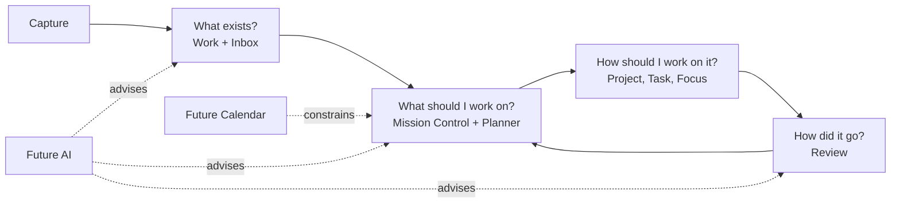
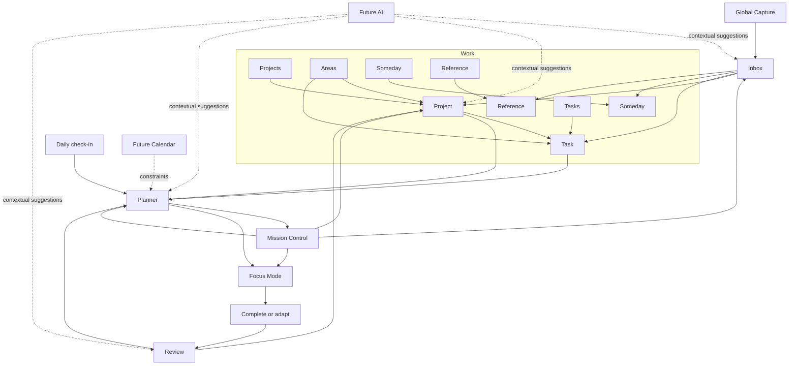

# Atlas Information Architecture

**Sprint:** 6.5.2
**Date:** 2026-08-24
**Status:** Product structure only. This document does not prescribe routes, components, persistence, or implementation sequence.

> **Sprint 7.1 implementation note:** Workspace now replaces Mission Control at
> the root route. The Mission Control model below remains the design lineage;
> current runtime boundaries and the three-region Workspace are documented in
> `docs/current-architecture.md` and `docs/features/workspace.md`.

## Purpose

Atlas is a private attention operating system for one person. Its information architecture should make four questions easy to answer:

1. **What exists?**
2. **What should I work on?**
3. **How should I work on it?**
4. **How did it go?**

The architecture must keep those questions distinct without making the product feel fragmented. Each screen should answer one primary question. Mission Control may summarize the whole system, but the canonical home of each piece of information remains elsewhere.

## Organizing model

Atlas has five stable product places:

| Place | Primary question | Responsibility |
| --- | --- | --- |
| **Mission Control** | What deserves attention now? | Orient the user across capacity, commitments, exceptions, and active outcomes |
| **Work** | What exists? | Hold Projects, Tasks, Someday Items, References, and Areas |
| **Planner** | What should I work on? | Turn available work and capacity into an explicit commitment |
| **Inbox** | What is this captured thought? | Clarify unprocessed Items into a trusted destination |
| **Review** | How did it go? | Reflect on commitments, outcomes, capacity, and necessary adjustments |

Three supporting surfaces do not become primary places:

- **Capture** is a global action available from every normal product screen.
- **Focus Mode** is a temporary execution mode entered from a committed Task.
- **Settings** is a utility area for preferences, privacy, and integrations.

Future AI is a capability inside existing decisions, not a new destination. Future Calendar belongs inside Planner because time is a planning constraint, not a second work system.



## Core language

The product needs stable language before it gains more screens. These terms should never be interchangeable:

| Term | Meaning |
| --- | --- |
| **Inbox** | Captured but not yet clarified |
| **Available** | Actionable work that could be chosen but is not committed |
| **Next action** | The one Project Task currently eligible to move its outcome |
| **Suggested** | Work Atlas recommends; it has not been accepted by the user |
| **Today** | Work the user has explicitly committed to for the current day |
| **Scheduled** | Work the user intends to address on a specific date |
| **Due** | Work whose outcome becomes late after a specific date |
| **Waiting** | Work paused for another person, event, or input |
| **Blocked** | Work that cannot move until a known obstacle is resolved |
| **Someday** | Intentionally inactive work that should not enter normal planning |
| **Completed** | Work deliberately finished; distinct from edited or archived work |
| **Daily check-in** | A forward-looking estimate of today's available attention |
| **Review** | A backward-looking reflection on what happened and what should change |

The distinction between **Daily check-in** and **Review** is especially important. Capacity estimation belongs before planning; reflection belongs after action. They may share historical context, but they answer opposite temporal questions.

## Complete sitemap

This is the conceptual product sitemap. Names describe information relationships and do not mandate URL structure.

```text
Atlas
├── First-use flow
│   ├── Welcome
│   ├── Basic preferences
│   ├── Initial Areas
│   └── Ready for Mission Control
│
├── Mission Control
│   ├── Now
│   │   ├── Today's capacity
│   │   ├── Today's commitment
│   │   └── Current focus
│   ├── Needs intervention
│   │   ├── Blocked or waiting work
│   │   └── Inbox pressure
│   └── Active outcomes
│       └── Compact Project horizon
│
├── Work
│   ├── Projects
│   │   ├── Active Projects
│   │   ├── Other Project states
│   │   └── Project workspace
│   │       ├── Outcome and health
│   │       ├── Current next action
│   │       ├── Project Tasks
│   │       ├── Exceptions
│   │       └── Project activity
│   ├── Tasks
│   │   ├── Available Tasks
│   │   ├── Waiting and Blocked Tasks
│   │   ├── Completed and Archived Tasks
│   │   └── Task detail
│   ├── Someday
│   │   └── Someday Item detail
│   ├── Reference
│   │   └── Reference detail
│   └── Areas
│       ├── Area overview
│       └── Area detail
│           ├── Projects in Area
│           └── Standalone Tasks in Area
│
├── Planner
│   ├── Daily check-in
│   ├── Today plan
│   │   ├── Available attention
│   │   ├── Atlas suggestions
│   │   ├── User commitment
│   │   └── Deferred work
│   ├── Upcoming agenda
│   └── Calendar [future]
│       ├── Day
│       ├── Week
│       └── External calendar constraints
│
├── Inbox
│   ├── Inbox queue
│   └── Process one Item
│       ├── Task
│       ├── Project
│       ├── Someday
│       ├── Reference
│       └── Delete
│
├── Review
│   ├── Daily reflection
│   ├── Weekly review
│   ├── Review history
│   └── Review detail
│       ├── Capacity and commitment
│       ├── Completed and deferred work
│       ├── Project movement
│       └── Notes and adjustments
│
├── Focus Mode [temporary mode]
│   ├── Current Task
│   ├── Essential Project context
│   ├── Next Task preview
│   └── Complete or adapt
│
├── Global Capture [global action]
│   ├── Capture title
│   ├── Confirmation
│   └── Undo
│
└── Settings [utility]
    ├── Personal preferences
    │   ├── Name
    │   ├── Locale
    │   └── Time zone
    ├── Planning preferences
    ├── Privacy and data
    ├── Calendar connections [future]
    └── AI preferences [future]
```

### Deliberate omissions from primary navigation

- Statuses such as Blocked, Waiting, Completed, and Archived are views or filters, not permanent product places.
- Areas are an organizational lens under Work, not a competing top-level workspace.
- Someday and Reference need visible homes, but not top-level navigation.
- Search is an access method across Work, not a separate place.
- Focus Mode is not a destination to browse; it is entered with a current commitment.
- AI has no global chat destination in the base architecture.
- Calendar does not become a separate planning system.
- The design-system showcase, API boundary, repositories, and database are outside the user-facing sitemap.

## Screen hierarchy

### Mission Control

**Primary question:** What deserves attention now?

Mission Control is the command centre and default entry point. It presents a decision hierarchy rather than a complete dashboard:

1. **Now:** today's capacity, accepted commitment, and current action;
2. **Needs intervention:** only exceptions requiring a decision;
3. **Active outcomes:** a compact, continuous Project horizon.

Mission Control may show Inbox count, upcoming pressure, or a check-in prompt, but it does not own those records. It links to Planner when a commitment must be created or changed, to Work when an outcome needs maintenance, to Inbox when thoughts need clarification, and to Review when the period should be closed.

Mission Control should not become:

- a complete Task list;
- a Project analytics dashboard;
- a calendar grid;
- an Inbox-processing form;
- a historical report.

### Work

**Primary question:** What organized work and knowledge exist?

Work is the stable home for clarified Items. Its default subview is Projects because outcomes provide the most useful long-term orientation. Secondary views expose Tasks, Someday, Reference, and Areas without adding them to global navigation.

Work owns search and cross-item retrieval. An Item processed out of Inbox must be findable here unless it was deleted. Archive remains a state within the relevant collection rather than a separate product place.

### Projects

**Primary question:** Which outcomes exist, and which one needs attention?

The Projects collection optimizes for scanning active outcomes. A Project summary should emphasize:

- outcome;
- current next action;
- health or exception state;
- recent movement.

The Project workspace zooms into one outcome. It owns Project definition, lifecycle, and the ordered work that supports it. Counts, dates, completed work, and activity remain supporting lenses rather than equal sections.

A Project can exist without a Task. A Project should never appear as executable work in Today or Focus Mode; only an actionable Task may do so.

### Tasks

**Primary question:** What concrete actions exist outside the current Project or planning lens?

Tasks has two roles:

1. provide a canonical home for standalone Tasks;
2. provide cross-Project retrieval when the user needs to find or maintain an action directly.

It is not designed as an endless default list. The initial view should privilege available and exceptional work; status, Area, Project, and time are lenses. The same Task detail is reached from Projects, Planner, Mission Control, Inbox confirmation, Review, or search so Task behavior remains consistent.

Task detail owns title, Area, optional Project, status, context, energy, duration, scheduled date, and due date. Planner owns whether that Task is suggested or committed today.

### Inbox

**Primary question:** What does this captured thought need to become?

Inbox owns only unclarified Items. It has two levels:

- a quiet queue summary showing scope and processing progress;
- a one-at-a-time processing screen.

Processing may create or update a Task, Project, Someday Item, or Reference, or delete the Item. Once processed, the destination—not Inbox—becomes canonical. A skip action allows pacing without changing the Item. Every immediate classification requires clear confirmation and a recovery path.

Inbox does not ask the user to plan the day. Turning a thought into a Task makes it available; it does not silently commit it to Today.

### Planner

**Primary question:** Given reality, what am I committing to?

Planner is the decision boundary between existing work and execution. It combines:

- today's date-scoped capacity check;
- available Project next actions and standalone Tasks;
- scheduled, due, and eventually calendar constraints;
- transparent Atlas suggestions;
- the user's accepted Today commitment;
- work deliberately deferred from the plan.

Planner distinguishes suggestions from commitments. Atlas may recommend a small set, but Today changes only when the user accepts or revises the plan. The result flows to Mission Control and Focus Mode.

Planner is not a backlog manager. Editing the definition or hierarchy of work returns the user to Work. It is also not a full calendar product; time exists here only to improve commitment decisions.

### Daily check-in

**Primary question:** How much attention is realistically available today?

Daily check-in is a focused subflow of Planner. It is forward-looking and strictly tied to a date. It captures a small capacity signal and optional context, then explains the consequence for planning. Reopening it means viewing or revising today's check-in—not creating an ambiguous duplicate.

Historical check-ins appear in Review because they become evidence only after the day has passed.

### Focus Mode

**Primary question:** What do I do now?

Focus Mode is the deepest, narrowest zoom level. It shows:

- the current Task as the dominant object;
- only enough Project outcome or context to preserve meaning;
- a restrained preview of what follows;
- explicit ways to complete or adapt the current commitment.

Global navigation is suppressed while focusing. Exit returns to the place that launched the mode, with Mission Control as a safe fallback. Focus Mode cannot reorganize Projects, process Inbox, or broaden the day's plan.

### Review

**Primary question:** What happened, and what should change?

Review closes the attention loop without grading the user. It has three scales:

- **Daily reflection:** commitment versus completion, exceptions, and a short adjustment;
- **Weekly review:** Project movement, repeated deferral, open loops, and likely capacity patterns;
- **History:** prior reviews and the evidence behind them.

Review uses completed work, plan history, capacity check-ins, blockers, and notes. It should lead to a small adjustment in Planner or Work, not produce a generic productivity score.

### Settings

**Primary question:** How should Atlas behave for me?

Settings contains preferences that apply across the product:

- name, locale, and time zone;
- planning defaults and review cadence;
- privacy and data controls;
- future Calendar connections;
- future AI consent and suggestion preferences.

Areas do not belong in Settings because they describe the user's life and work, not application behavior. Settings should remain a utility destination and should not compete with the five primary places.

### Future AI

**Primary question:** Where can assistance reduce decision effort without taking control?

AI is a contextual capability, not an information silo. Appropriate entry points are:

- Inbox: suggest a destination or missing clarification;
- Project workspace: suggest a breakdown or identify a missing next action;
- Planner: propose and explain a focus plan;
- Review: summarize patterns and suggest a small adjustment.

AI output remains visibly suggested until accepted. Acceptance passes through the same product decisions and domain rules as manual input. AI must not silently create work, reclassify Inbox, commit Today, complete Tasks, change dates, or modify Projects. A global chatbot is not part of the base sitemap because it would create a parallel interaction model and obscure where accepted information lives.

### Future Calendar

**Primary question:** How do real time constraints affect the plan?

Calendar is a Planner lens. It combines Atlas's scheduled work with external commitments so the user can judge what fits. Its information appears in three places:

- Planner owns the day and week agenda;
- Mission Control may surface immediate time pressure;
- Project workspace may show dates relevant to one outcome.

External calendar events remain owned by their calendar provider. Atlas may use them as read-only constraints by default; any external write requires explicit intent. Calendar events do not automatically become Tasks, and Atlas Tasks do not automatically become external events. Calendar connection and permissions belong in Settings.

## Navigation hierarchy

### Primary navigation

The persistent product navigation contains five destinations in a stable order:

1. **Mission Control**
2. **Work**
3. **Planner**
4. **Inbox**
5. **Review**

The same hierarchy should remain recognizable across mobile and desktop even if its visual presentation changes. Inbox may show a count because it represents unprocessed input. Other counts should appear only when they communicate an exception, not as persistent productivity metrics.

### Secondary navigation

Secondary navigation appears only inside its parent place:

| Parent | Secondary choices |
| --- | --- |
| Work | Projects, Tasks, Someday, Reference, Areas |
| Planner | Today, Upcoming, Calendar (future) |
| Review | Daily, Weekly, History |

The default choices are Projects for Work, Today for Planner, and the currently relevant reflection period for Review.

### Context navigation

- Project workspace exposes its parent collection, Area, related Tasks, Planner relevance, and Mission Control summary.
- Task detail exposes its Project when present, its Area, its planning state, and the screen that opened it.
- Area detail is a filtered Work lens and never traps the user in a separate hierarchy.
- Review evidence may open a historical Task or Project, then return to the same point in Review.
- Inbox confirmation may open the newly processed destination, but the default flow continues to the next Inbox Item.

### Global actions

- Capture is always available outside onboarding, sensitive settings flows, and Focus Mode.
- Search is available across Work and can be invoked globally, but results resolve to canonical Work destinations.
- Settings is available from the application utility area rather than primary navigation.

### Mode navigation

Focus Mode replaces normal navigation with only:

- complete or adapt;
- next commitment when appropriate;
- exit to the launch context.

This isolation is intentional. It should not be copied to Planner, Inbox, Daily check-in, or Review, all of which need clear exits.

## Relationships between screens



### Canonical ownership

Each concept has one canonical home even though it may be summarized elsewhere:

| Concept | Canonical home | Useful projections elsewhere |
| --- | --- | --- |
| Project | Work → Projects | Mission Control horizon, Planner context, Review movement |
| Task | Work → Tasks or its Project workspace | Mission Control, Planner, Focus Mode, Review |
| Area | Work → Areas | Filters and context across Work, Planner, and Review |
| Unprocessed Item | Inbox | Inbox count and pressure on Mission Control |
| Someday Item | Work → Someday | Review prompt when reconsideration is useful |
| Reference | Work → Reference | Linked context from Projects or Tasks |
| Daily capacity | Planner → Daily check-in | Mission Control, plan explanation, Review history |
| Today commitment | Planner → Today | Mission Control, Focus Mode, Review |
| Completion evidence | Review history, sourced from Work events | Project activity and Mission Control feedback |
| External event | Calendar provider | Planner and Mission Control constraint |
| AI suggestion | No canonical record until accepted | Contextual surface that requested it |

This prevents duplicated truth. For example, Mission Control can show a Project's next action but editing the Project remains a Work responsibility. Review can show a completed Task but does not own the Task.

## Zoom levels

Atlas uses progressive zoom rather than adding more dashboards.

| Level | Scope | Primary screens | Question |
| --- | --- | --- | --- |
| **0 — Ambient** | Capture without leaving the current context | Global Capture | What must I not forget? |
| **1 — System** | Whole-life orientation | Mission Control | Where does attention belong now? |
| **2 — Collection** | A class of organized information or a time horizon | Projects, Tasks, Inbox, Planner, Review history | What exists in this lens? |
| **3 — Context** | One outcome, Area, or day | Project workspace, Area detail, Today plan, daily Review | What is happening in this context? |
| **4 — Item** | One concrete object | Task, Reference, Someday Item, Inbox processing item | What is this, and what can happen to it? |
| **5 — Focus** | One current action | Focus Mode | What do I do now? |

### Zoom behavior

- Moving deeper reduces competing information.
- Moving outward restores orientation without discarding the user's place.
- A Task has one detail experience regardless of the path used to reach it.
- Time is a lateral lens, not a parent-child hierarchy: the same Task can appear in Work, Today, Upcoming, and Review without being duplicated.
- Status is also a lens, not a place: Blocked and Waiting Items remain owned by their Task or Project context.
- Focus Mode is the only level that intentionally removes global navigation.

The structural zoom is:

```text
Atlas
└── Area
    ├── Project
    │   └── Task
    └── Standalone Task
```

The temporal lens crosses that structure:

```text
Past review  ←  Today commitment  →  Upcoming agenda
```

Neither hierarchy replaces the other. Work answers what an Item is; Planner and Review answer where it sits in time.

## Primary user journeys

### 1. First use

```text
Welcome → personal defaults → choose initial Areas → Mission Control
```

The user should reach Atlas's core orientation experience before being required to design a Project. A first Project or capture can be offered contextually after setup, not used as proof that setup is complete.

### 2. Daily orientation and commitment

```text
Mission Control → Daily check-in → Planner suggestions
→ user accepts or adjusts Today → Mission Control → Focus Mode
```

The journey makes the transition from suggestion to commitment explicit. Returning later on the same date shows the existing check-in and plan rather than silently creating another.

### 3. Capture and clarify

```text
Any normal screen → Capture → confirmation → previous context
→ later open Inbox → process one Item → canonical destination → next Item
```

Capture never asks for Area, Project, dates, or energy. Triage never silently commits a Task to Today. Someday and Reference remain findable in Work.

### 4. Advance a Project

```text
Mission Control or Work → Project workspace
→ inspect outcome, next action, and exceptions
→ maintain Project or Task → Planner when committing work
```

Project maintenance and daily commitment remain separate decisions. A Project never enters Focus Mode directly.

### 5. Find and maintain standalone work

```text
Work → Tasks → search or filter → Task detail
→ edit, schedule, associate with Project, or return to collection
```

This journey prevents non-Project Tasks from becoming invisible while avoiding a generic Task list as the product home.

### 6. Focus and adapt

```text
Mission Control or Planner → Focus Mode
→ complete, block, defer, or exit
→ next committed Task or Mission Control
```

Changing the Task's truth is allowed. Broad replanning returns to Planner rather than expanding Focus Mode.

### 7. Daily reflection

```text
Mission Control prompt or Review → Daily reflection
→ compare commitment with outcome → record one adjustment
→ Mission Control or next Planner
```

The purpose is to improve tomorrow's decision, not to produce a score.

### 8. Weekly review

```text
Review → week summary → inspect Project movement and repeated deferral
→ open relevant Project or Planner → make a small correction → Review complete
```

Review deep-links to canonical Work and Planner screens rather than duplicating their editing tools.

### 9. Future calendar-aware planning

```text
Planner → Upcoming or Calendar → see external constraints and Atlas work
→ revise scheduled intent → accept Today → Focus Mode
```

The external calendar constrains the decision but does not take ownership of Atlas work.

### 10. Future AI-assisted decision

```text
Inbox, Project, Planner, or Review → request suggestion
→ inspect reason and proposed change → accept, revise, or dismiss
→ accepted result enters the normal Atlas destination
```

There is no separate AI Inbox, AI plan, or AI-owned data model from the user's point of view.

## System boundaries

### What Atlas owns

- Areas as stable life and responsibility contexts;
- Projects, their outcomes, lifecycle, and current next action;
- Tasks, including Area, optional Project, work state, and planning metadata;
- Inbox Items until they are clarified;
- Someday and Reference classifications;
- date-scoped capacity check-ins;
- suggested plans, accepted Today commitments, and explicit deferrals;
- completion and adaptation evidence needed for reflection;
- user-authored Review notes and decisions;
- personal planning preferences.

### What Atlas presents but does not own

- external Calendar events;
- AI-generated suggestions before acceptance;
- linked Reference content stored elsewhere;
- platform-level notification delivery;
- identity-provider credentials.

### What Atlas should not become

- a team collaboration or resource-management system;
- an external Calendar replacement;
- a document repository;
- a time-tracking or productivity-scoring system;
- an autonomous AI agent that changes commitments without consent;
- a universal hierarchy where every concept must be represented as the same visible object;
- a dashboard that exposes all available data at once.

### Responsibility boundaries between places

| Place | Owns | Reads or projects | Must not do |
| --- | --- | --- | --- |
| Mission Control | No canonical work records | Capacity, Today, exceptions, Project horizon, Inbox pressure | Edit every underlying object or become a reporting dashboard |
| Work | Project, Task, Area, Someday, and Reference identity and lifecycle | Planning state and activity where context is useful | Decide today's commitment |
| Planner | Suggestions, accepted commitment, deferral, scheduling intent | Work, capacity, dates, Calendar constraints | Redefine Project outcomes or become a backlog |
| Inbox | Unclarified Items and triage progress | Possible destination context | Plan the day or retain ownership after processing |
| Focus Mode | Current execution context and explicit adaptations | Today commitment and essential Project context | Reorganize the system |
| Review | Reflection, historical interpretation, and adjustments | Plans, completions, capacity, exceptions, Project movement | Grade the user or duplicate Work editing |
| Settings | Cross-product preferences and connections | System capabilities | Hold domain concepts such as Areas or Projects |
| Future AI | Nothing before explicit acceptance | Context needed for a requested suggestion | Become an authoritative data owner |
| Future Calendar | External events remain externally owned | Scheduled Atlas work and plan capacity | Automatically create or complete Atlas work |

## IA rules for future features

Before adding a new screen, answer these questions:

1. Which of the four product questions does it answer?
2. Is the information already owned by an existing place?
3. Is this a new destination, a secondary lens, a contextual action, or a temporary mode?
4. What becomes less visible as the user zooms into it?
5. Where does the user return after completing the decision?
6. Does it create a second meaning for Today, scheduled, due, next action, or Review?
7. Can every accepted result be found again in its canonical home?
8. Does it preserve user authority over planning and status changes?

A feature should become a primary destination only if it represents a durable user intent that cannot be answered clearly inside Mission Control, Work, Planner, Inbox, or Review.

## Summary

Atlas's information architecture is a loop, not a collection of modules:

```text
Capture → Clarify → Orient → Commit → Focus → Reflect
              ↑          Projects and Areas          │
              └──────────────────────────────────────┘
```

Mission Control keeps the whole system legible. Work preserves what exists. Planner turns possibility into commitment. Inbox protects attention at capture time. Focus Mode narrows the world to one action. Review turns experience into a better next decision. Settings supports the system without becoming part of the work itself.

Future AI and Calendar capabilities should strengthen that loop from within its existing places. They should not introduce parallel navigation, duplicate ownership, or remove the user's final say over where attention belongs.
