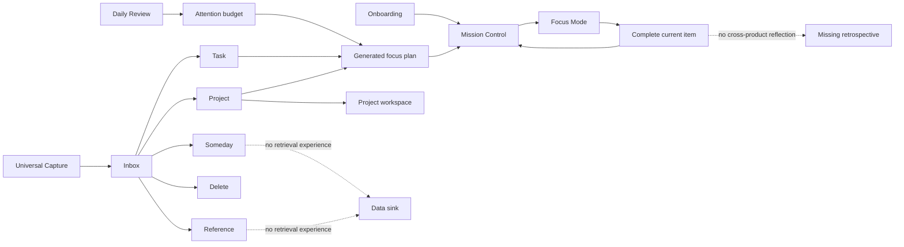
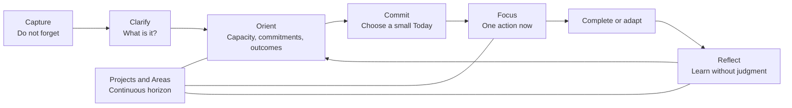

# Atlas Product & UX Audit

**Sprint:** 6.5.1
**Date:** 2026-08-24
**Status:** Product and UX assessment only. This document does not propose an implementation.

## Executive assessment

Atlas has a credible product idea: capture without friction, clarify later, estimate available attention, and surface a very small amount of work. The strongest parts of the current product already support that idea. Universal Capture is intentionally lightweight, Inbox processing uses progressive disclosure, Projects begin with outcomes, and Focus Mode removes most competing information.

The product is not yet a coherent attention system, however. It currently behaves like three partially connected products:

1. a calm daily capacity check and recommendation engine;
2. a detailed Project and Task manager;
3. a capture and triage system whose non-actionable outputs are not visible again.

The most important product risk is trust. A historical Daily Review can silently drive a later day, Project Tasks marked Someday can be projected into Today, scheduled and due dates do not influence the plan, and most created work receives the same attention score. The interface presents the resulting plan with confidence but does not explain or let the user shape it. If Atlas cannot make the meaning of “Today” and its recommendations predictable, the user will keep a second planning system in their head.

The recommended direction is to define Atlas as a **daily attention decision system with a continuous Project horizon**, not as a comprehensive task manager. Its core loop should be capture → clarify → orient → commit → focus → reflect. Projects and Areas should preserve context around that loop; they should not turn Mission Control into another reporting dashboard.

## Audit basis

This review is based on:

- `AGENTS.md` and every document currently under `docs/`;
- the PostgreSQL and Prisma model in `prisma/schema.prisma`;
- all current application routes;
- feature components, hooks, feature contracts, application services, domain rules, repository adapters, and the HTTP composition boundary;
- loading, error, empty, responsive, focus, and keyboard behavior expressed in the source.

The in-workspace visual browser was unavailable during this audit. Visual hierarchy observations therefore come from the rendered component hierarchy and responsive styles rather than a screenshot-based visual QA pass. They should be validated on real mobile and desktop viewports before a future design is approved.

No application code or behavior was changed as part of this sprint.

## Current product shape

Atlas currently exposes these user-facing places:

| Place | Current role |
| --- | --- |
| Mission Control (`/`) | Greeting, latest attention budget, generated focus, blocked work, Inbox count, and active Projects grouped by Area |
| Projects (`/projects`) | Searchable, sortable, filterable overview of all Projects |
| Project workspace (`/projects/[id]`) | Outcome, Project metrics, Task hierarchy, dates, and Task state collections |
| Inbox (`/inbox`) | One-at-a-time processing of captured thoughts |
| Daily Review (`/review`) | Energy, stress, motivation, notes, and an attention-budget result |
| Focus Mode (`/focus`) | Current focus, next action, blocked work, and completion |
| Onboarding (`/onboarding`) | Initial Areas, first Project, and first next action |
| Design system (`/design-system`) | Internal component showcase rather than part of the product journey |

There is no dedicated Task, Planning, Calendar, Reference, Someday, Area-management, or Retrospective place.

## Current strengths

### Product strengths

- **The purpose is differentiated.** “Where should my attention go?” is a stronger product question than “What tasks exist?”
- **Capture respects the moment.** Universal Capture asks only for a title, works from every product screen, supports a desktop shortcut, and uses a thumb-reachable mobile action.
- **Triage is deliberately calm.** Inbox processing presents one item at a time, uses keyboard shortcuts, and reveals details only after the user chooses a destination.
- **Projects are outcome-first.** The Project model and UI make the desired outcome more important than a list of tasks.
- **Focus is constrained.** The current rule engine limits focus to three items and Focus Mode intentionally removes Projects, Inbox, and navigation choices.
- **Empty data is treated honestly.** Fresh PostgreSQL installations contain no demo work, and the UI has reusable empty and loading states.
- **Accessibility has been considered.** Native buttons and form controls, semantic sections, focus styles, live announcements, keyboard-accessible rating controls, and focus return in mobile capture are present.
- **Mobile-first intent is visible.** Major layouts begin as single columns, controls wrap, and richer grids appear at larger breakpoints.

### Architectural strengths

- UI depends on feature contracts rather than repositories.
- Application services own repository use, and a server-only composition root selects Prisma implementations.
- Domain calculations are deterministic and independently testable.
- Projects and Tasks are explicit domain refinements while preserving compatibility with the broader Item model.
- Daily Reviews are stored historically rather than overwritten.
- Repository contracts keep persistence replaceable, and no feature UI imports Prisma.

## Current weaknesses

- Atlas has no stable product navigation. Contextual links expose only parts of the product, and some screens have no visible exit until a flow is complete.
- Mission Control gives prime space to a greeting and ratings while the ongoing Project horizon appears last.
- “Today” means several different things: user status, Project next-action projection, and generated focus recommendation.
- The Attention Engine looks personalized, but newly created work generally receives the same attention score of 50.
- Daily Review results are historical, but the latest result is reused without confirming it belongs to today.
- Standalone Tasks, Someday items, and References have no complete retrieval or management experience.
- Project detail is dense and repeats Tasks across several state-based views.
- Date fields are captured but do not affect Today, focus ranking, or any cross-Project agenda.
- There is no retrospective loop, despite storing reviews and completed work.
- Onboarding requires both a first Project and first action before the user has experienced Atlas's core value.
- `docs/vision.md` and `docs/roadmap.md` are empty, leaving important product semantics to be inferred from implementation tickets.

## Area-by-area review

### 1. Navigation

**What problem is it trying to solve?**
Navigation should give the user a reliable mental model of Atlas and let them move between deciding, capturing, clarifying, doing, and maintaining work without adding visual noise.

**Is the current UX the simplest solution?**
It is visually minimal, but not cognitively simple. Atlas has no global navigation. Mission Control provides contextual links to Review, Focus Mode, Inbox, and Projects; other screens expose only selected return links. Daily Review has no visible way back before completion, Focus Mode returns only to Mission Control, and the not-found screen advises going back without providing an action. The user must remember the route graph.

**What friction exists?**

- Important destinations are discoverable only when their related section is visible.
- There is no persistent indication of where the user is.
- Cross-workflow movement often requires returning to Mission Control first.
- The universal desktop capture field receives focus when the shell mounts, which can take keyboard intent away from the page the user opened.
- The absence of navigation makes future Calendar or Retrospective experiences harder to introduce without further fragmentation.

**How could it be simplified?**
Adopt a small, stable orientation model around the few enduring product places, while keeping Focus Mode intentionally isolated. Navigation should communicate Atlas's product model, not enumerate every data type or setting. Contextual links can remain, but they should accelerate a journey rather than be the only way to discover it.

### 2. Mission Control

**What problem is it trying to solve?**
Mission Control should answer: “Given my capacity, active outcomes, and constraints, where does attention belong now?” It should also preserve enough Project visibility that the user does not fear losing the larger horizon.

**Is the current UX the simplest solution?**
Not yet. The current order is greeting and attention, Today's Focus, Blocked and Inbox, then Projects grouped by Area. This is a clean component composition, but it treats several independent summaries as equally important. The large greeting is emotionally calm but consumes the most valuable space without helping the decision. Projects appear only after the daily and exception layers, and empty Areas create repeated low-value cards.

**What friction exists?**

- A Project outcome becomes the large headline in Today's Focus while the executable Task is labelled “Supporting action.” This can make the screen inspirational but less immediately actionable.
- Project summaries omit the current next action and meaningful exception state, even though those are the Project facts most relevant to attention.
- Blocked Project Tasks are nested under Projects, while the focus-plan blocked query currently checks only top-level Items. Mission Control can therefore hide the blockers most likely to affect active outcomes.
- An old Daily Review can still appear as the current attention budget.
- The attention card always offers “Complete daily review,” even after displaying a saved result, without clarifying whether this edits or adds another review.
- Projects with no work and Areas with no Projects occupy generous empty-state space.
- Loading and error copy still refers to “this browser's data” even though persistence is PostgreSQL.

**How could it be simplified?**
Organize Mission Control into three attention horizons: **Now**, **Needs intervention**, and **Active outcomes**. The current action should be unmistakable; capacity should inform rather than dominate it; exceptions should appear only when they require a decision; and every active Project should retain a compact, continuous presence through its outcome, next action, and health. Greeting, Inbox count, and review prompts should support this hierarchy rather than compete with it.

### 3. Projects

**What problem is it trying to solve?**
Projects hold larger outcomes, preserve why work matters, and organize Tasks that collectively make an outcome true.

**Is the current UX the simplest solution?**
The outcome-first model is strong, but the workspace is closer to a conventional project-management dashboard than a calm personal operating system. The overview exposes search, Area and status filters, sorting, progress, four Task counts, scheduled work, remaining effort, and last activity. Detail then presents a hero, hierarchy, timeline, and separate Blocked, Waiting, Completed, and Unscheduled collections.

**What friction exists?**

- There is no direct way to create a Project from the Project overview; creation is available through Inbox processing or onboarding.
- There is no Project editing or lifecycle action for title, outcome, description, Area, status, completion, or archive.
- Progress is calculated from completed versus non-archived Task count. It can move backwards when Tasks are added and does not prove that the outcome is closer.
- The same Task can appear in the hierarchy, timeline, and one or more state collections, creating visual repetition.
- Four always-present filters are heavy for a single-user workspace, especially when there are few Projects.
- Task-management controls and secondary metrics compete with the Project outcome.
- “Break this Project down” and “Create Task” offer two adjacent creation models without a clear situational distinction.

**How could it be simplified?**
Make Project health legible through the smallest set of outcome-relevant facts: outcome, current next action, exception state, and recent movement. Treat counts, dates, history, and completed work as supporting detail revealed when needed. Project progress should describe confidence or outcome movement, not merely the ratio of checked Tasks. The Project overview should optimize for scanning and reorientation; detail should optimize for deciding the next intervention.

### 4. Tasks

**What problem is it trying to solve?**
A Task represents concrete executable work. It always belongs to an Area and may belong to a Project, allowing both standalone responsibilities and outcome-related actions.

**Is the current UX the simplest solution?**
The shared Task editor and progressive “Planning details” disclosure are good foundations. The complete Task experience is not simple because it is distributed across Inbox, Project detail, Mission Control, and Focus Mode, with no canonical place to find a standalone Task.

**What friction exists?**

- There is no Task overview or standalone Task detail.
- A standalone Active, Waiting, Blocked, Someday, Completed, or Archived Task may have no route through which it can be found and edited.
- Inbox processing always turns a Task into Today, even when it has a due or scheduled date in the future.
- Project child order determines the implicit next action, but the significance of that order is easy to miss.
- Reordering uses small up/down actions rather than a rapid ordering interaction and becomes noisy on mobile.
- Completion is direct only in Focus Mode; Project detail requires opening Edit and changing status.
- The UI cannot set the attention score used as “impact,” while services assign a default of 50 to newly created Tasks.
- Duration, energy, context, due date, scheduled date, status, Area, and Project are all supported, but several currently have no downstream behavioral effect.
- Project selectors can include Projects whose lifecycle state may no longer be appropriate for new work.

**How could it be simplified?**
Define one canonical Task lifecycle and use the same interaction wherever a Task appears. Keep the default Task to title, Area, and an unambiguous commitment state; reveal Project and planning metadata only when they change a real decision. Make “next action” explicit rather than an accidental consequence of list position. Standalone Tasks need a trusted retrieval path, even if Atlas never becomes a generic Task list.

### 5. Inbox

**What problem is it trying to solve?**
Inbox protects attention at capture time by separating remembering from organizing. Processing later should turn each thought into a trustworthy destination.

**Is the current UX the simplest solution?**
For the current item, mostly yes. One-at-a-time processing, direct classification, keyboard shortcuts, and progressively disclosed Task or Project fields are appropriately restrained. The simplicity breaks after classification because not every destination has a usable home.

**What friction exists?**

- Someday Items and References disappear from the visible product after processing.
- The newest captured item appears first, so an active capture stream can indefinitely postpone older entries.
- There is no “skip for now” action to reach another Inbox item without leaving the screen.
- Choosing Task silently commits the item to Today.
- Choosing Someday or Reference acts immediately, with no visible undo.
- The Project picker is Area-filtered but not clearly limited to Projects that are still active.
- Error text still describes data as browser-local.

**How could it be simplified?**
Preserve one-at-a-time triage, but make every choice lead to a visible, comprehensible destination. The decision should first distinguish actionable from non-actionable, then ask only the information required by that destination. “Process later” should be a legitimate pacing choice. Classification must not silently mean commitment to today.

### 6. Daily Review

**What problem is it trying to solve?**
Daily Review estimates current capacity so Atlas can recommend an amount and energy level of work that fits the day. It is explicitly not intended to be journaling.

**Is the current UX the simplest solution?**
The single screen and three 1–5 selectors are understandable, but the result implies more precision than the input supports. Energy, stress, and motivation are all mandatory; the deterministic formula converts them into a percentage from 19 to 95 and predefined prose. This is simple computationally, but not necessarily simple conceptually.

**What friction exists?**

- Atlas loads the latest Review, not necessarily today's Review.
- “Start again” creates another historical record rather than clearly editing today's check-in.
- Notes are stored but not visible after the result or in any history.
- Review history is available through the application layer but has no user-facing experience.
- A precise value such as 72% can overstate the reliability of three subjective ratings.
- The user is not told how the budget changes the number or energy of suggested items.
- The Review page has no visible exit before completion.

**How could it be simplified?**
Treat the review as a clearly date-scoped capacity check, not a score-producing form. Emphasize a comprehensible capacity band and planning consequence over numerical precision. The user should understand whether they are creating, revising, or reviewing today's check-in, and historical notes should serve reflection rather than vanish after submission.

### 7. Planning

**What problem is it trying to solve?**
Planning should convert capacity, active outcomes, and available actions into a credible commitment for today while limiting overload and context switching.

**Is the current UX the simplest solution?**
There is no explicit Planning experience. A rule-based plan is generated automatically whenever Mission Control or Focus Mode loads. Automation removes steps, but it also removes the moment where the user understands and accepts the plan.

**What friction exists?**

- The user cannot distinguish generated suggestions from committed work.
- The number of selected items is determined by budget thresholds: up to one item at 1–35, two at 36–70, and three above 70.
- Each active Project contributes at most one action. An explicit Today Task wins; otherwise the first Active **or Someday** Task can be projected into Today without persistence or explanation.
- Multiple Today Tasks in one Project can exist, but only one is considered as that Project's next action.
- Scheduled dates, due dates, duration, urgency, and overdue state do not influence selection.
- Attention score is a major ranking input, but normal creation paths do not capture a meaningful score.
- Deferred candidates are calculated but never shown, so the user cannot see what was intentionally left out.
- Focus Mode permits completion but not accepting, replacing, deferring, skipping, or blocking an item.

**How could it be simplified?**
Separate three concepts: **available work**, **Atlas's recommendation**, and **the user's commitment**. Recommendations should be explainable in plain language and easy to reshape. “Today” should have one stable meaning. The planning moment should remain small—no scheduling board—but it must give the user agency and confidence before Focus Mode narrows the screen.

### 8. Calendar readiness

**What problem is it trying to solve?**
Calendar readiness should help Atlas understand when work is intended, when it is due, and how planned work fits into a real day without turning Atlas into a calendar clone.

**Is the current UX the simplest solution?**
The model has a useful minimal distinction between `scheduledDate` and `dueDate`, and Project detail has a date-based timeline. That is a partial data foundation, not a calendar-ready experience.

**What friction exists?**

- There is no cross-Project agenda, day, week, or calendar view.
- A Task scheduled for today does not automatically become available to Today's Focus.
- Due today and overdue work are not surfaced or ranked.
- Dates are display metadata; they do not affect attention planning.
- There are no times, time zones per commitment, all-day semantics, recurrence rules, external calendar identifiers, or conflict awareness.
- Duration is stored but not used to assess whether work fits the day.
- Date display uses fixed locale assumptions rather than user preferences.

**How could it be simplified?**
Define temporal semantics before expanding the interface: scheduled means “I intend to work on this date,” while due means “the outcome becomes late after this date.” Prove those two concepts in daily orientation and planning before considering a full calendar surface or external sync. Calendar readiness should begin with a trustworthy agenda, not a month grid.

### 9. Capture

**What problem is it trying to solve?**
Capture should remove the fear of forgetting without forcing the user to switch context or make organizational decisions.

**Is the current UX the simplest solution?**
Yes in data requirements: title-only capture is the right default. The mobile floating action and desktop shortcut match their platforms. The persistent desktop form is less clearly simple because it is always visually present and automatically takes focus on page load.

**What friction exists?**

- Desktop autofocus may interrupt a user who opened a page to review or edit something else.
- Persistent capture competes with the bottom of every product screen and may feel more prominent than the current decision.
- Capture waits for a server round trip; failure preserves the thought, but the interaction is not offline-capable.
- Success is transient and has no undo or direct path to the captured item.
- Same-tab custom events refresh Inbox and Mission Control counts, but they do not form a durable cross-tab or cross-device synchronization model.

**How could it be simplified?**
Keep a single ubiquitous capture action and the title-only contract, while making its presentation subordinate to the current screen. Capture should feel immediately safe: preserve text until confirmed, acknowledge success clearly, and offer recovery from accidental capture without opening an organization flow.

### 10. Retrospective

**What problem is it trying to solve?**
Retrospective should help the user learn whether attention estimates, commitments, and Projects reflect reality. Its purpose is adjustment, not productivity scoring or journaling.

**Is the current UX the simplest solution?**
There is no retrospective experience. The absence avoids clutter, but it leaves the core attention loop open. Atlas estimates capacity and selects work without ever helping the user compare intention with outcome.

**What friction exists?**

- Historical Daily Reviews are stored but never shown.
- Completed work is visible only inside each Project.
- There is no cross-Project view of what moved, what remained blocked, or what was repeatedly deferred.
- Task completion has no dedicated `completedAt`; `updatedAt` also changes for edits and cannot reliably represent completion history.
- There is no event or status history from which to reconstruct a day or week.
- Review notes cannot be revisited.
- Generated focus plans are not persisted, so Atlas cannot compare what it suggested with what happened.

**How could it be simplified?**
Close the loop with a lightweight periodic reflection on three questions: what moved, what consumed or protected attention, and what should change next. Use existing work and review evidence wherever possible. Avoid streaks, performance grades, and broad analytics; the output should improve the next planning decision.

## Major UX risks

| Severity | Risk | User consequence |
| --- | --- | --- |
| Critical | Someday, Reference, and some standalone Task states have no retrieval experience | Processing Inbox can make trusted information effectively disappear |
| Critical | The latest Daily Review is treated as current without a date check | An old capacity estimate can silently shape today's plan |
| Critical | Nested blocked Project Tasks are omitted from the focus plan's blocked collection | Mission Control can report calm while an active outcome is blocked |
| High | Today, suggested focus, scheduled work, and Project next action have overlapping meanings | The user cannot predict what Atlas will surface or why |
| High | Planning ranks mostly uniform attention scores and ignores dates and duration | Recommendations appear intelligent without using the most decision-relevant evidence |
| High | No stable navigation or product map | Features remain hidden and every new capability increases wayfinding cost |
| High | Projects are last on Mission Control but highly detailed elsewhere | The user alternates between losing the horizon and being overloaded by it |
| High | Project lifecycle and Area maintenance are incomplete | Core organizational structures become difficult to correct as reality changes |
| Medium | Daily Review percentages imply unwarranted precision | The user may either over-trust the score or dismiss the whole mechanism |
| Medium | Dense Project metrics and repeated Task collections recreate task-manager overhead | Atlas drifts away from its attention-first promise |
| Medium | Onboarding requires a Project and next action before value is demonstrated | First use asks for organization before establishing trust |
| Medium | Destructive and immediate classifications have limited recovery | Fast flows become brittle when the user makes a mistake |

## Architectural risks

These are product risks caused or amplified by the current architecture; they are not an implementation proposal.

| Risk | Why it matters to the product |
| --- | --- |
| No user or ownership boundary in PostgreSQL | Atlas is described as private and single-user, but a deployed server has one shared dataset with no model-level ownership boundary. Availability from multiple devices is therefore not the same as private access. |
| Whole-collection Item persistence | Many commands load the full Item tree and save a replacement snapshot. Two devices acting from stale snapshots can overwrite or delete each other's work despite a serializable transaction. Cost also grows with every Item. |
| Generic unvalidated RPC endpoint | `/api/atlas` accepts feature, operation, and untyped argument arrays, then casts them before dispatch. Domain validation helps, but malformed or unintended requests do not have a consistent runtime contract. |
| Client-first data loading | Most product routes render client components that call a generic API after mount. This introduces loading flashes and repeat round trips while underusing the documented Server Component default. |
| Ephemeral focus plans | The recommendation is recalculated, not stored as a dated planning decision. It cannot be explained later, compared with outcomes, or used for retrospective learning. |
| Ambiguous relationship fields | Tasks carry both `parentId` and `projectId`; compatibility logic accepts several relationship shapes. The database cannot enforce that a Project reference points to a Project or that Task and Project Areas match. |
| Incomplete temporal history | `updatedAt` is the only broad activity marker. There is no dedicated completion time or event history, which limits reliable Project progress and retrospective evidence. |
| Static personal context | User name, locale, and time zone are hardcoded in the server composition root rather than being user preferences. Date and greeting behavior will not adapt cleanly across travel or deployment contexts. |
| Cross-repository onboarding is not atomic | Areas are saved before the first Project. A failure between those operations can leave onboarding technically complete but product setup incomplete. |
| Domain-language tension | `AGENTS.md` says everything is an Item, while Areas and Daily Reviews are separate persistence models and Projects and Tasks require many type-specific rules. The abstraction is useful, but treating it as absolute can obscure clearer product concepts. |
| Ad hoc client refresh events | Capture notifies selected same-tab views through browser events. This does not establish authoritative freshness across tabs, devices, or future server-rendered views. |
| Missing product specification | Empty `vision.md` and `roadmap.md` leave terms such as Today, active next action, attention budget, and Project progress defined primarily by code. Product intent can drift with each sprint. |

## Recommended product direction

### Product position

Atlas should be the place a single user decides where attention belongs and preserves confidence that important outcomes are still moving. It should not compete with team project-management systems, time trackers, calendars, note archives, or generic to-do databases on feature breadth.

The smallest coherent product loop is:

### Directional principles

1. **Make Today a promise, not a filter.** Atlas may recommend work, but only the user should establish the final daily commitment. Scheduled, due, available, suggested, and committed must remain distinct.
2. **Keep Projects continuously visible but compact.** The user should always be able to see active outcomes, current next actions, and exceptions without loading a full reporting dashboard.
3. **Earn trust before adding intelligence.** A transparent rule using meaningful inputs is more valuable than a sophisticated-looking score built from defaults. Explanations and user correction should precede AI suggestions.
4. **Guarantee a home for every classification.** Inbox processing is only trustworthy when Task, Project, Someday, Reference, and Delete all have predictable consequences and recovery paths.
5. **Let dates change decisions.** Store planning metadata only when Atlas can use it to orient the day, warn about a constraint, or explain a recommendation.
6. **Design for interruption and low capacity.** Every workflow should be resumable, forgiving, and useful when the user has less attention than expected.
7. **Close the learning loop without scoring the person.** Retrospective should improve future estimates and commitments, not produce guilt, streak pressure, or productivity grades.
8. **Keep the product map smaller than the domain model.** Users need a few stable places organized around intent; they do not need a destination for every enum or database table.

### Information hierarchy for the product

Atlas can remain calm if information is organized by decision distance:

| Horizon | Question | Information that belongs here |
| --- | --- | --- |
| Now | What deserves attention now? | Current commitment, capacity constraint, one next action |
| Intervention | What prevents progress or needs a decision? | Blockers, waiting decisions, overdue clarification, Inbox pressure |
| Outcomes | What larger results must remain visible? | Active Project outcome, next action, health, recent movement |
| Reflection | What should inform the next decision? | Completed commitments, repeated deferral, capacity pattern, review context |

This hierarchy supports Mission Control as a command centre without turning it into a dense dashboard. It also gives future Calendar and AI capabilities a clear role: they should improve orientation and commitment, not add parallel systems.

## Product decisions to resolve before implementation design

The next design phase should settle these semantics before producing screens or technical tickets:

1. What exact action turns an Atlas recommendation into the user's Today commitment?
2. Can a Task be both scheduled and Today, and which state wins when the date changes?
3. Should attention budget remain a percentage, become a band, or use both with different emphasis?
4. What makes Project progress meaningful when outcome completion is not proportional to Task count?
5. Where do Someday and Reference live, and what prompts their return without creating another backlog?
6. How does a user revise today's Daily Review without corrupting historical meaning?
7. Which Project exception is important enough to appear on Mission Control?
8. What is the smallest stable navigation model that preserves Focus Mode's intentional isolation?
9. Which evidence should influence planning now, and which inputs should be removed until they have a real effect?
10. What should a retrospective help the user decide differently tomorrow or next week?

These are product-definition questions, not engineering tasks. Resolving them will prevent Atlas from accumulating more screens around ambiguous concepts.

## Conclusion

Atlas should preserve its strongest constraints: immediate capture, one-at-a-time clarification, outcome-led Projects, a maximum of three focus items, and a distraction-free Focus Mode. The next product move is not greater feature breadth. It is to make the existing loop trustworthy and continuous: every captured thought has a home, every recommendation has an understandable reason, every daily commitment has one meaning, every active outcome remains visible, and completed work informs the next decision.

That direction is consistent with the project's stated purpose: reduce cognitive load by helping one person decide where attention belongs.
