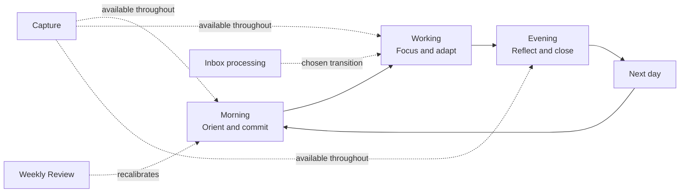
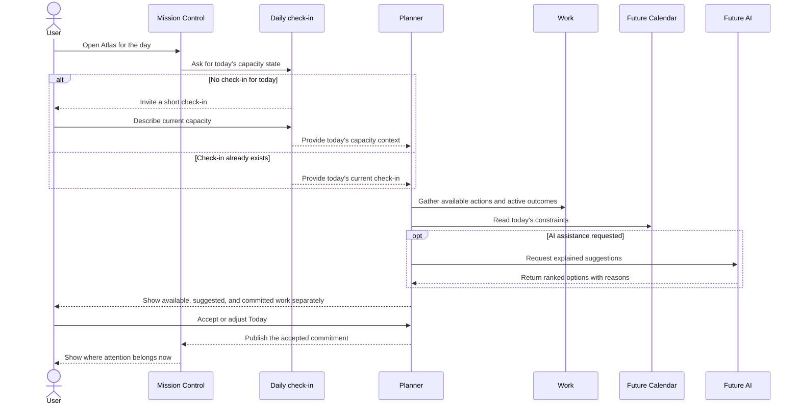
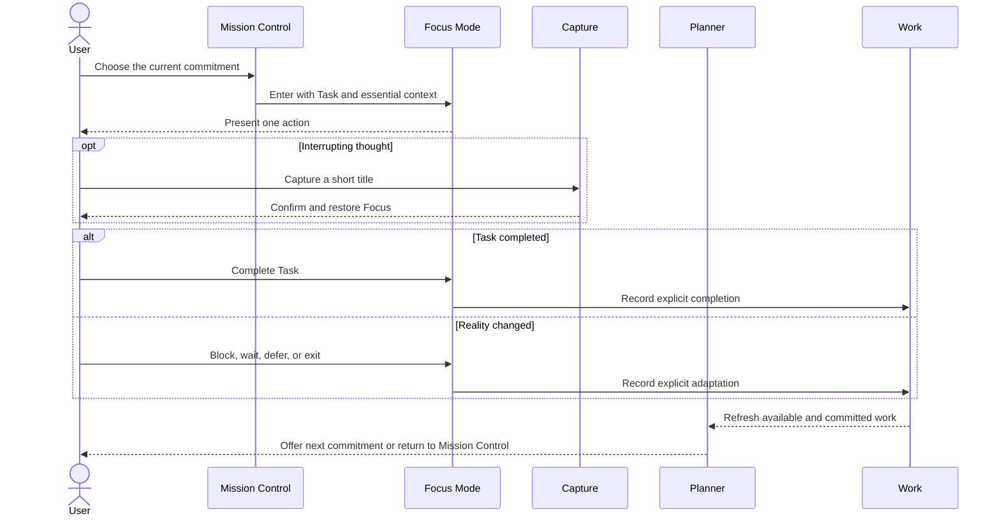
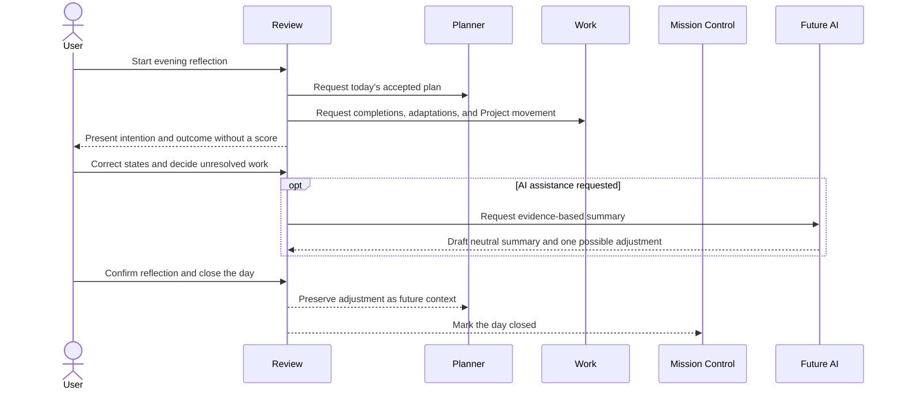
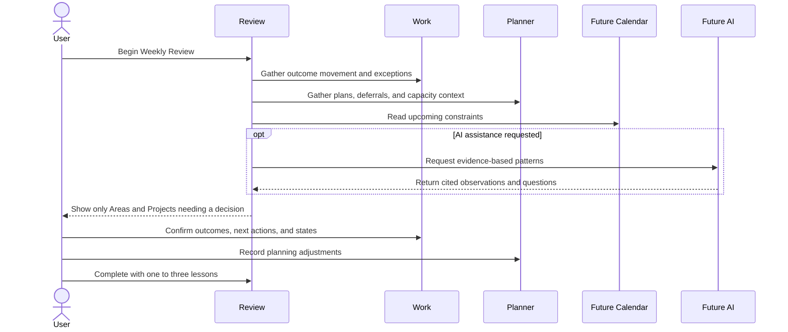
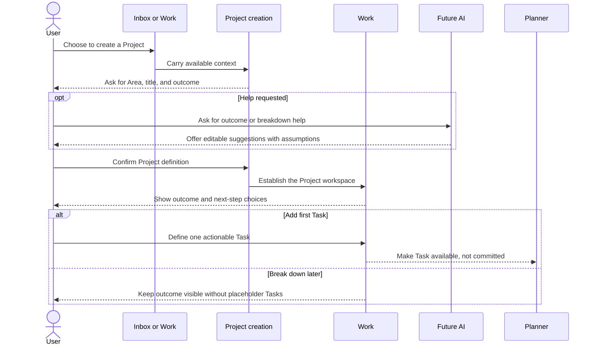
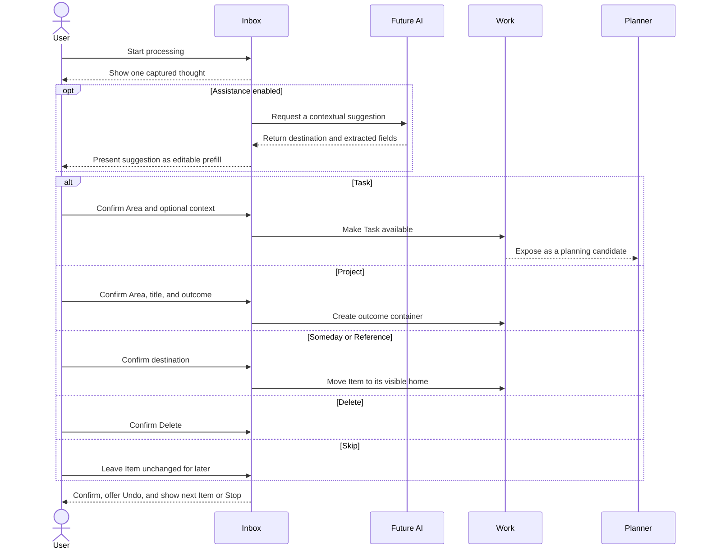
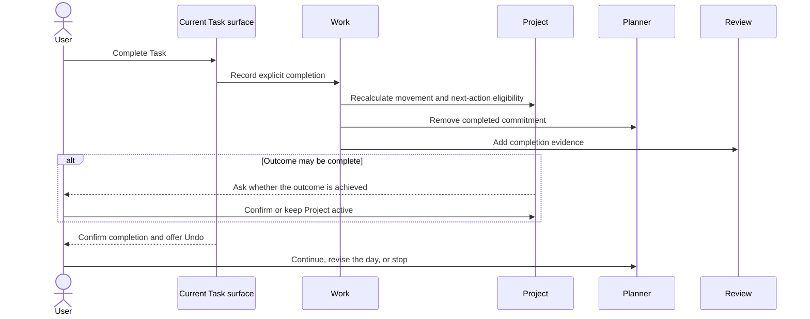
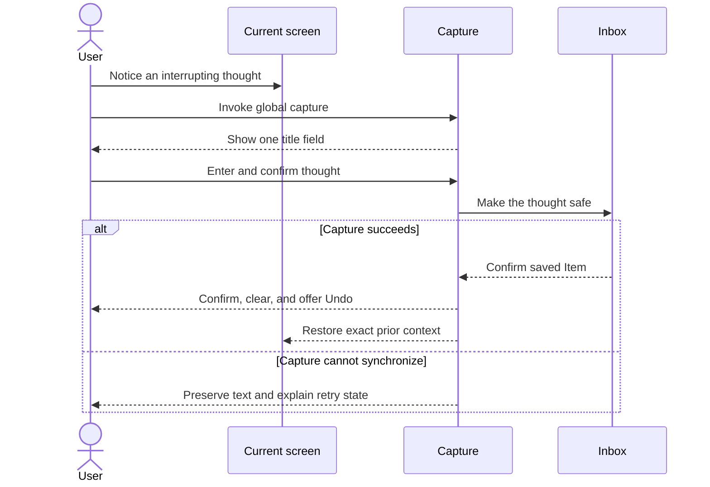
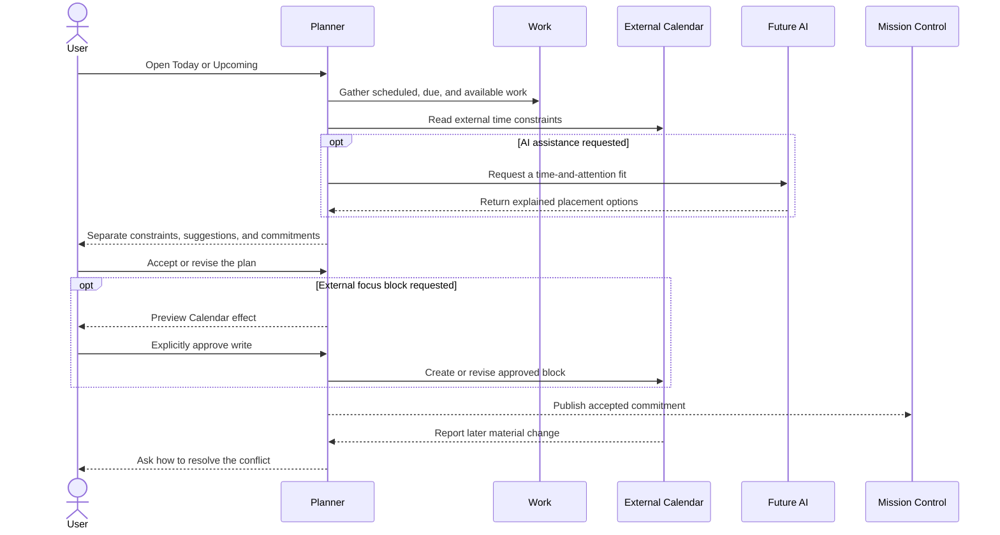

# Atlas User Journeys

**Sprint:** 6.5.3
**Date:** 2026-08-24
**Status:** Journey design only. This document does not prescribe implementation.

## Purpose

Atlas should follow the shape of the user's day rather than expose the shape of its data. The user should experience a continuous loop:

```text
Orient → Commit → Focus → Adapt → Reflect
   ↑                                     │
   └──────────── learn and return ───────┘
```

Capture and clarification support that loop without interrupting it. Projects and Areas preserve the wider horizon. Calendar information constrains real capacity. AI may reduce decision effort, but it never becomes the decision-maker.

## Journey design principles

1. **Start from human triggers.** A journey begins because the day started, attention changed, work finished, or a thought appeared—not because a record needs updating.
2. **One decision at a time.** Each screen asks one primary question and reveals detail only when it changes that decision.
3. **Suggestions are not commitments.** Atlas may recommend work; only the user creates or revises Today.
4. **Every interruption is resumable.** Leaving, capturing, or adapting should preserve the user's previous context.
5. **Incomplete work is information, not failure.** Evening and weekly journeys help the user adjust without guilt or automatic rollover.
6. **Every classification has a visible home.** Processing an Inbox Item must never make it disappear into an unreachable state.
7. **AI advises; automation prepares.** AI can propose or explain. Automation can assemble evidence or apply explicit rules. The user retains authority over classification, commitment, status, deletion, and external effects.
8. **The manual journey is complete.** Every journey must work calmly when AI, Calendar, or automation is unavailable.

## The day at a glance

| Moment | User need | Atlas response | Healthy end state |
| --- | --- | --- | --- |
| Morning | Understand reality and choose a small day | Mission Control, Daily check-in, Planner | An explicit Today commitment |
| Working | Advance one meaningful action | Focus Mode with essential context | Progress, completion, or an honest adaptation |
| Interruption | Preserve a thought without switching context | Global Capture | Thought is safe in Inbox; prior context is restored |
| Transition | Clarify captured thoughts when attention permits | One-at-a-time Inbox processing | Each Item has a trusted destination |
| Evening | Close open loops and learn from the day | Daily Review | The day is closed without silently planning tomorrow |
| Weekly | Rebuild confidence in the wider horizon | Weekly Review | Active outcomes have clear next decisions |



## 1. Morning

### Trigger

The user intentionally opens Atlas near the start of their day, or opens Planner because they need to decide what the day can realistically hold.

### Goal

Understand today's capacity and constraints, then make a small, explicit commitment that keeps active Project outcomes visible.

### Steps

1. Mission Control opens with today's date, current plan state, urgent exceptions, Inbox pressure, and a compact active-Project horizon.
2. If no capacity check exists for today, Atlas invites a short Daily check-in. The user may still inspect the day before completing it.
3. The user records current energy, stress, motivation, and optional context.
4. Atlas describes capacity in understandable terms and explains its planning consequence without presenting false precision.
5. Planner brings together available Project next actions, standalone Tasks, scheduled and due work, and future Calendar constraints.
6. Atlas separates **available work**, **suggested work**, and any **existing commitment**.
7. The user accepts, removes, replaces, or reorders suggestions and establishes Today.
8. Mission Control reflects the accepted commitment and offers the first Task as a Focus Mode entry.

### Pain points

- A previous day's capacity estimate may be mistaken for today's state.
- Old Today Items may silently roll forward and make the day feel pre-decided.
- A precise attention percentage can imply confidence the inputs do not support.
- Suggestions can feel arbitrary when attention scores are defaults or dates are ignored.
- A full Inbox or long Project list can overwhelm the morning decision.
- A user in a hurry may resent being forced through a check-in before seeing their day.
- Calendar commitments and Task durations may contradict the proposed workload.

### Potential AI assistance

- Explain why each Task is suggested using visible evidence such as outcome importance, energy fit, deadline, duration, and switching cost.
- Offer a lower-capacity alternative plan rather than simply removing work.
- Identify likely overcommitment or excessive Area switching.
- Ask one clarifying question when a missing next action makes an important Project impossible to plan.
- Summarize relevant context from the user's optional check-in note.

AI suggestions remain optional and individually dismissible. AI does not commit Today.

### Future automation

- Establish a clear local day boundary using the user's time zone.
- Assemble scheduled, due, deferred, and incomplete work as planning evidence.
- Move unfinished commitments into a “decide again” state rather than automatically keeping them in Today.
- Read external Calendar constraints when a connection is enabled.
- Restore the user's last unfinished morning step after an interruption.
- Offer a gentle check-in reminder according to explicit user preferences.

Automation never creates the day's commitment without confirmation.

### Sequence diagram



## 2. Working

### Trigger

The user is ready to begin a committed Task, returns after an interruption, or needs to decide what to do next during the day.

### Goal

Advance one meaningful action with minimal switching while making it easy to record changed reality.

### Steps

1. Mission Control shows the current committed Task and enough Project context to explain why it matters.
2. The user enters Focus Mode.
3. Focus Mode reduces the screen to the current Task, essential context, and a restrained preview of what follows.
4. The user works without Project metrics, Inbox, navigation, or unrelated Tasks competing for attention.
5. If a thought interrupts, Global Capture saves it and returns the user to the same Focus context.
6. The user either completes the Task or records an honest adaptation: blocked, waiting, deferred, or exit without change.
7. Atlas shows the consequence calmly and asks whether to continue with the next committed Task or return to Mission Control.
8. If capacity or the day has materially changed, the user returns to Planner to revise the remaining commitment.

### Pain points

- Focus Mode may show a Task without enough Project outcome or practical context.
- Completion can be the only adaptation, encouraging inaccurate status.
- Automatically advancing to the next Task can create a treadmill rather than a conscious transition.
- Blocked Project Tasks may be absent from system-level exception views.
- A new meeting or drop in energy can make the morning plan unrealistic.
- Persistent capture UI or notifications can compete with the current action.
- The user may lose their position after capturing or opening reference material.

### Potential AI assistance

- Summarize the minimum context needed to restart a Task after interruption.
- Surface the most relevant linked Reference or Project outcome on request.
- Suggest a concrete next step when the Task is too broad, without replacing the Task automatically.
- Offer a lower-energy alternative from the accepted plan when capacity changes.
- Help phrase a blocker or waiting condition so it is actionable later.

AI does not infer completion or change status from inactivity.

### Future automation

- Restore the exact Focus context after Capture or an accidental navigation.
- Record explicit focus transitions as evidence for Review without turning Atlas into a time tracker.
- Refresh the remaining plan after an explicit completion or status change.
- Surface a Calendar transition when an external commitment is approaching.
- Suppress nonessential Atlas prompts while Focus Mode is active.

Automation never marks a Task complete or starts another Task on the user's behalf.

### Sequence diagram



## 3. Evening

### Trigger

The user chooses to close the workday, opens Review, or responds to a preferred end-of-day prompt.

### Goal

Close open loops, understand what changed, and leave tomorrow unburdened by silent carryover.

### Steps

1. Review opens with the day's accepted commitment, explicit completions, adaptations, capacity check, and Project movement already assembled.
2. The user confirms anything completed outside Atlas and corrects inaccurate states.
3. Each unfinished commitment is treated as a decision: make it available again, schedule it, mark it waiting or blocked, move it to Someday, or leave it for tomorrow's Planner to reconsider.
4. Atlas shows outcomes that moved and exceptions that remain, without using a productivity score.
5. The user optionally records what affected attention and one adjustment worth carrying forward.
6. The user closes the day.
7. Mission Control no longer presents the old plan as today's active commitment after the date boundary.

### Pain points

- Without a persisted plan, Atlas cannot reliably compare intention with outcome.
- `updatedAt` cannot distinguish completion from ordinary editing.
- Review can become a second task-maintenance session when too many corrections are required.
- Automatic rollover hides overcommitment and creates an ever-growing Today list.
- Unfinished work can be framed as failure rather than planning evidence.
- Notes can disappear into history without affecting a future decision.
- A long or demanding day may leave too little energy for a detailed reflection.

### Potential AI assistance

- Draft a neutral summary from explicit events and user notes.
- Identify the smallest likely cause of mismatch, such as interruption, underestimated duration, or too much context switching.
- Suggest one planning adjustment for tomorrow.
- Highlight an active outcome that moved despite an incomplete Task list.
- Ask for confirmation when evidence is ambiguous rather than inventing a conclusion.

AI does not grade the day, assign blame, or choose tomorrow's work.

### Future automation

- Preassemble commitment, completion, blocker, Calendar, and capacity evidence.
- Save an explicit day boundary and preserve the plan as historical evidence.
- Present unresolved work as a small decision queue.
- Apply user-defined reminder timing and allow the Review to be postponed.
- Carry a confirmed adjustment into the next Planner as context, not as a commitment.

Automation never rolls unfinished work into Today without a new decision.

### Sequence diagram



## 4. Weekly Review

### Trigger

The user's chosen weekly cadence arrives, or the user opens Review because the wider system no longer feels trustworthy.

### Goal

Regain confidence that active outcomes, next actions, constraints, and deferred work still reflect reality.

### Steps

1. Review opens with a quiet summary of the week: completed commitments, repeated deferrals, capacity patterns, Project movement, blockers, waiting work, and upcoming constraints.
2. The user scans Areas to notice imbalance without requiring equal progress everywhere.
3. The user reviews only Projects that need a decision: stale, blocked, missing a next action, nearing a date, or potentially complete.
4. For each relevant Project, the user confirms the outcome and chooses the next intervention.
5. The user reviews unresolved Inbox pressure and deliberately selected Someday candidates; Atlas does not force a full backlog review.
6. Upcoming Calendar constraints and due dates inform the next week's shape.
7. The user records one to three adjustments, then closes the Review.
8. Confirmed changes return to their canonical Work or Planner home.

### Pain points

- Reviewing every Project and Task becomes maintenance overhead.
- Task-count progress can misrepresent movement toward an outcome.
- Missing completion and plan history makes weekly evidence unreliable.
- Large analytics surfaces can turn reflection into performance judgment.
- Someday and Reference Items may be invisible or resurface without relevance.
- Repeatedly deferred work may signal ambiguity, low value, or poor estimation, but the product may treat all three alike.
- The user can finish with many edits but no clearer next week.

### Potential AI assistance

- Identify Projects with no current next action, repeated deferral, unresolved blockers, or no recent movement.
- Summarize capacity patterns with explicit evidence and uncertainty.
- Suggest which Someday Items may be relevant to upcoming commitments.
- Draft a Project status summary from completed Tasks and user-authored outcomes.
- Offer a small set of review questions tailored to actual exceptions.

AI must cite the Atlas evidence behind every pattern and cannot archive, activate, or reprioritize work automatically.

### Future automation

- Assemble the week's plans, completions, Review notes, Project changes, and Calendar constraints.
- Apply user-defined thresholds for “needs review” without changing Project state.
- Detect Projects missing next actions and dates approaching within a chosen horizon.
- Preserve where the user stopped so the Review can span multiple short sessions.
- Schedule the next Review prompt according to preference.

Automation narrows the review set; it does not perform the Review.

### Sequence diagram



## 5. Project Creation

### Trigger

The user recognizes that a captured thought or desired outcome requires more than one action, or intentionally starts a Project from Work.

### Goal

Create a clear outcome container without forcing premature task breakdown or adding the Project directly to Today.

### Steps

1. The user begins from an Inbox Item or the Projects collection.
2. Atlas asks for the Area, a concise Project title, and the desired outcome: what will be true when the Project is complete.
3. Description and other context remain optional.
4. The user creates the Project.
5. Atlas shows the new Project in its canonical workspace with the outcome dominant.
6. The user chooses among three honest next steps: add one first Task, rapidly break down the Project, or do this later.
7. If a Task is added, it becomes available work. It enters Today only through Planner and explicit commitment.
8. The user returns to Inbox processing, Projects, or the new Project workspace according to the launch context.

### Pain points

- Project creation may be available only through Inbox or onboarding rather than Projects.
- Requiring a first Task contradicts outcome-first thinking and can invite low-quality placeholder work.
- Too many metadata fields can make creation feel like project administration.
- An unclear outcome produces a Task container rather than a meaningful Project.
- Immediate breakdown can overwhelm the user with a long generated list.
- Duplicate or overlapping Projects may be hard to notice.
- A new Project can become invisible if it has no next action, while forcing one creates false certainty.

### Potential AI assistance

- Help rewrite a vague intention into an observable outcome while preserving the user's meaning.
- Identify a possible duplicate or overlapping active Project.
- Suggest a small first-action set only when requested.
- Explain assumptions behind a proposed breakdown and let the user accept Tasks individually.
- Flag when the input is probably a single Task rather than a Project.

AI never creates the Project, Tasks, or Today commitment without confirmation.

### Future automation

- Carry the captured title and description into the Project draft.
- Suggest a likely Area based on explicit prior patterns, while requiring confirmation.
- Return the user to the originating flow after creation.
- Surface Projects without next actions during Weekly Review after a reasonable interval.
- Preserve an unfinished Project draft across interruption.

Automation does not invent placeholder Tasks or auto-activate the Project in Planner.

### Sequence diagram



## 6. Inbox Processing

### Trigger

The user intentionally opens Inbox to clarify captured thoughts, often during a transition or after Mission Control indicates meaningful Inbox pressure.

### Goal

Give one captured thought a trustworthy destination in less than twenty seconds without forcing a planning decision.

### Steps

1. Inbox shows one Item and the remaining count, not the entire backlog.
2. The user may process it, skip it for now, or leave without losing progress.
3. The first decision is whether the Item is actionable.
4. If actionable, the user chooses Task or Project.
5. A Task requires Area; Project, duration, energy, context, due date, and scheduled date remain optional. The result becomes available, not Today.
6. A Project requires Area, title, and desired outcome; description is optional. Adding a first Task remains a separate choice.
7. If non-actionable, the user chooses Someday, Reference, or Delete.
8. Atlas confirms the destination, offers Undo, and makes the processed Item immediately findable in Work.
9. The user continues to the next Item or stops.

### Pain points

- Newest-first processing can starve older Items.
- Without Skip, one difficult Item blocks access to the rest of Inbox.
- Task classification may silently commit work to Today.
- Someday and Reference can become invisible destinations.
- Immediate classification and Delete can lack recovery.
- A long Project list makes optional association slower.
- Asking every optional Task field undermines fast processing.
- Duplicate thoughts can become duplicate work.

### Potential AI assistance

- Suggest Task, Project, Someday, or Reference with a short reason and confidence.
- Extract a possible Area, Project, date, duration, energy, or context from the captured title.
- Identify likely duplicates or an existing Project relationship.
- Ask one clarifying question only when it materially changes the destination.
- Offer a concise Project outcome draft when the thought is clearly multi-step.

AI suggestions are prefill, not action. Low-confidence suggestions should remain silent rather than add noise.

### Future automation

- Preserve queue position and partial form state across interruption.
- Rotate skipped Items fairly so older thoughts remain reachable.
- Return focus to the next meaningful control after each decision.
- Apply explicit keyboard and touch shortcuts consistently.
- Maintain an undo window and restore the Item to its prior Inbox position.
- Preload destination context such as configured Areas and active Projects.

Automation never classifies or deletes an Inbox Item without user confirmation.

### Sequence diagram



## 7. Task Completion

### Trigger

The user finishes a Task while in Focus Mode or encounters the completed Task from Mission Control, Planner, Project workspace, Tasks, or Task detail.

### Goal

Record completion once, preserve meaningful evidence, and reveal the consequence without forcing the next commitment.

### Steps

1. The user chooses Complete from any projection of the Task.
2. Atlas updates the canonical Task and records completion as a distinct event in time.
3. The Task leaves the active Today commitment and remains available in Project and Review history.
4. If the Task belongs to a Project, Atlas recalculates the available next action and updates Project movement.
5. If completion may satisfy the Project outcome, Atlas asks the user whether the outcome is actually complete.
6. Atlas shows calm confirmation and offers Undo.
7. The user chooses the next already-committed Task, returns to Mission Control, or opens Planner to revise the day.

### Pain points

- Completion may be available only in Focus Mode.
- Editing a status is slower and less legible than a direct completion action.
- `updatedAt` cannot reliably distinguish completion from an edit.
- The next Project Task can be advanced automatically without the user understanding why.
- Task-count progress may imply that Project outcome progress is equally mechanical.
- Immediate advancement to the next Task can remove a needed pause.
- Accidental completion needs a simple recovery path.

### Potential AI assistance

- Suggest whether the Project outcome may now be achieved, with evidence.
- Summarize how the Task contributed to the outcome for Review.
- Identify a likely missing next action when no actionable Project Task remains.
- Propose—but not commit—a next Task if the Project should continue.

AI never infers completion from elapsed time, external activity, or text changes.

### Future automation

- Remove the completed Task from Today and Focus projections immediately.
- Record a dedicated completion event for Project activity and Review.
- Recalculate Project next-action eligibility and health.
- Preserve the next eligible Task as available rather than automatically committing it.
- Offer a time-limited Undo that restores the prior state and plan position.

Automation updates consequences of an explicit completion; it does not decide that completion occurred.

### Sequence diagram



## 8. Capture

### Trigger

A thought, obligation, idea, reminder, or observation appears while the user is doing something else.

### Goal

Make the thought safe in under five seconds and return the user to exactly what they were doing.

### Steps

1. The user invokes Capture from any normal product screen using the platform-appropriate global action.
2. Atlas presents one title field without asking for Area, Project, dates, type, or energy.
3. The user enters the thought and confirms.
4. Atlas preserves the title until capture succeeds.
5. Atlas confirms that the thought is in Inbox, clears the field, and offers Undo.
6. The prior screen, scroll position, and focus context are restored.
7. Organization happens later through Inbox Processing.

### Pain points

- Automatic focus on a persistent desktop field can steal intent from the opened screen.
- Capture controls can compete visually with the current decision.
- Waiting for a network response makes capture feel unsafe or slow.
- A failed request can make the user wonder whether the thought was saved.
- No Undo makes accidental or duplicate capture costly.
- Opening Inbox immediately after every capture defeats separation of capture and organization.
- Capture inside Focus Mode can become a route out of focus if it reveals too much UI.

### Potential AI assistance

AI should not be in the critical capture path. It may later help during Inbox Processing by suggesting classification or extracting context. At capture time, predictive rewriting or classification risks delay, surprise, and loss of the user's original words.

### Future automation

- Preserve unsent text through interruption, temporary connection loss, or accidental dismissal.
- Confirm locally that the thought is safe, then synchronize when possible.
- Retry failed synchronization without duplicating the Item.
- Restore the exact prior interaction context after capture.
- Support rapid consecutive captures without opening Inbox.
- Provide a short Undo window while retaining the original text.

Automation never classifies the thought or removes the user's wording at capture time.

### Sequence diagram



## 9. Calendar Planning

### Trigger

The user opens Planner to shape today or the coming week, or Atlas notices that an external Calendar change conflicts with an accepted commitment.

### Goal

Reconcile time constraints, attention capacity, duration, and meaningful work without turning Atlas into a second Calendar.

### Steps

1. Planner opens Today or Upcoming with external events shown as constraints and Atlas work shown as work.
2. The user sees scheduled dates, due dates, duration, and current commitments with distinct meanings.
3. Atlas estimates what can fit using both available time and attention, while showing uncertainty.
4. The user places or revises scheduled intent and chooses what belongs in Today.
5. If the user wants an external focus block, Atlas previews the Calendar effect and asks for explicit approval.
6. The accepted plan appears on Mission Control and in Focus Mode.
7. If an external event changes, Atlas surfaces the conflict and asks the user to revise the affected commitment.

### Pain points

- Scheduled and due dates can be treated as display-only metadata.
- A Task scheduled for today may not appear in planning automatically.
- Duration can be stored but ignored when assessing fit.
- Missing time, time-zone, recurrence, and all-day semantics create ambiguity.
- Two-way synchronization can produce duplicates or surprising external changes.
- A Calendar grid can overwhelm the attention decision with irrelevant events.
- Automatically converting events to Tasks, or Tasks to events, creates duplicate ownership.
- A plan that fits available time may still exceed available energy.

### Potential AI assistance

- Suggest a plan that fits both attention and genuine open time.
- Explain conflicts, switching cost, and why a Task may not fit.
- Offer alternative placement for flexible work.
- Suggest realistic buffers around travel or demanding meetings when the evidence supports it.
- Identify a due-date risk before it becomes urgent.

AI may propose Calendar changes but cannot make an external write without explicit approval.

### Future automation

- Read external events according to granted permissions.
- Normalize time zones, recurring events, and all-day commitments.
- Recalculate available planning windows after Calendar changes.
- Detect overlap between accepted Atlas work and external commitments.
- Keep scheduled Atlas intent synchronized across Atlas views.
- Apply explicit user rules for read-only versus approved write behavior.
- Notify the user only when a change materially affects an accepted plan.

Automation never turns Calendar events into Tasks, creates external events from Tasks, or moves commitments silently.

### Sequence diagram



## Cross-journey trust rules

The same rules apply throughout the day:

| Event | Atlas may do automatically | Atlas must ask the user |
| --- | --- | --- |
| New day | Open a fresh planning context and assemble evidence | Commit or roll over work |
| Capacity change | Recalculate possible fit | Change Today |
| Capture | Preserve, confirm, retry, and restore context | Classify or delete the thought |
| Inbox processing | Prepare options and destination context | Choose and confirm the destination |
| Task completion | Update projections after explicit completion | Decide that the Task is complete |
| Project movement | Recalculate next-action eligibility | Declare the outcome achieved |
| Calendar change | Detect and explain a conflict | Move work or write externally |
| AI suggestion | Explain, rank, and prefill | Accept any state-changing result |
| Evening boundary | Preserve the day as history | Choose the fate of unfinished work |
| Weekly Review | Assemble and narrow the evidence | Change Project, Task, or planning state |

## Journey continuity

Atlas should preserve these forms of continuity across every journey:

- **Context continuity:** return to the same screen, Item, scroll position, and focus target after a temporary action.
- **Decision continuity:** an interrupted form or Review resumes without losing confirmed work.
- **Temporal continuity:** yesterday, today, and upcoming remain distinct; nothing silently changes period.
- **Ownership continuity:** an Item has one canonical home even when projected elsewhere.
- **Explanation continuity:** suggestions carry their reasons into Planner, Focus, and Review.
- **Recovery continuity:** Capture, classification, completion, and external writes provide an appropriate undo or correction path.

## Summary

Atlas should feel like one calm day rather than a series of database views:

- Morning establishes reality and commitment.
- Working protects one meaningful action and records changed reality honestly.
- Capture makes interruptions safe without requiring organization.
- Inbox Processing clarifies thoughts without planning the day.
- Project Creation defines outcomes without forcing placeholder Tasks.
- Task Completion acknowledges progress without starting a treadmill.
- Evening closes the day without guilt or silent rollover.
- Weekly Review restores confidence in the wider horizon.
- Calendar Planning makes real constraints visible without duplicating ownership.

AI can reduce interpretation effort. Automation can prepare context and preserve continuity. Neither replaces the user's judgment about what something is, what belongs in Today, whether work is complete, or where attention belongs next.
